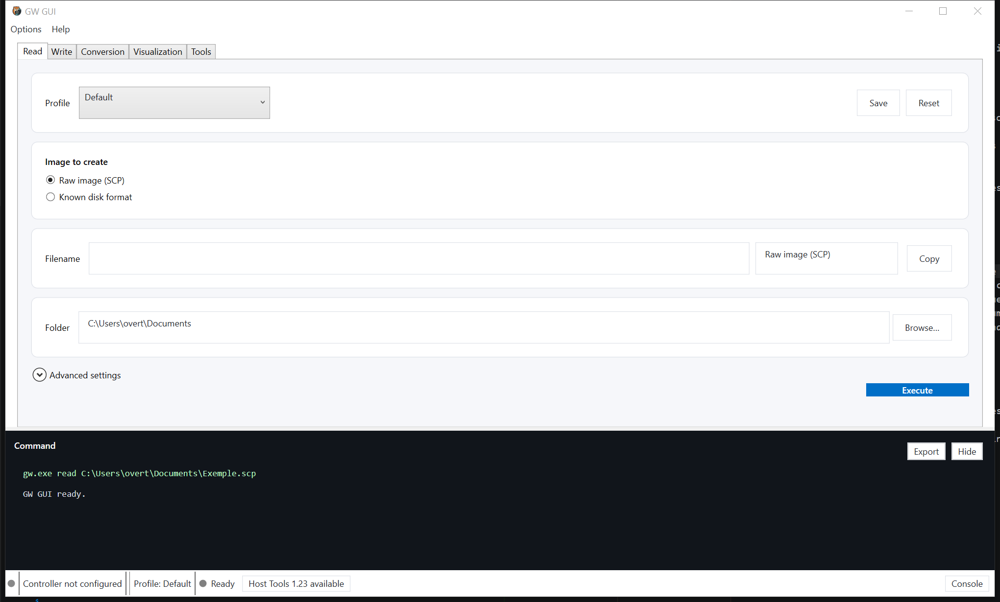

# User guide — GW GUI

## First-time setup

1. Open **Options → Preferences**.
2. Detect or select `gw.exe`. Downloading Host Tools from the application is always an explicit action.
3. Under **Hardware**, scan for the Greaseweazle controller and describe each connected drive.
4. Choose the default image folder, language and theme.

Disconnected controllers and drives remain registered. Scan again only when their port or configuration changes.

## Read

- **Raw SCP image** archives the disk flux directly.
- **Known disk format** decodes to ADF, ST, IMA or another compatible container.
- The filename field never contains the extension.
- Automatic numbering supports numbers or letters and advances only after a successful read.
- Technical controls are folded under **Advanced settings**.
- The **Default** profile disables every optional setting. Saving creates a profile belonging only to Read.

When a file exists, a dialog offers three explicit buttons: **Overwrite**, **Use the next number**, or **Let me edit the name**. Closing the dialog starts nothing and also returns to name editing.

## Write

Select a source image. GW GUI detects its format from the container and size when reliable; ambiguity must be resolved manually. A mandatory summary shows the file, format, drive and verification state before writing. Disabling verification is an advanced option highlighted as unsafe.

## Convert

Format checkboxes handle both single and multiple conversion. Outputs incompatible with the source are disabled. With no explicit extension checked, the normal extension is used; selecting one or more extensions replaces that implicit choice. Selected formats remain pinned at the top.

Tags such as `[PC-720]` and `[AMIGA-DD]` prevent collisions in multi-conversion. Each output runs separately, and the final report preserves successful outputs when another conversion fails.

## SCP visualization

Open an SCP capture to display both sides, zoom, pan and select a track. The inspector shows revolutions, estimated speed, checksum and structures recognized by the automatic or manually selected decoder.

## Disk Explorer

The **Disk Explorer** tab directly opens Amiga ADF/SCP and Atari ST/MSA/ATR/SCP images. It displays the volume name when available, file system, capacity and free space in read-only mode. The currently interpreted file systems are AmigaDOS OFS/FFS, Atari TOS FAT12 and Atari DOS. Folders appear on the left with `+` and `−` controls; the selected folder contents appear on the right with distinct icons and precise type labels for folders, text, images, audio, archives, programs and disk images. Selection uses a neutral color instead of the blue accent. Loading an image in Disk Explorer also prepares it in Visualization, and conversely, without automatically moving the user to the other tab.

Detection can remain automatic or be forced through the same ordered format list used by the other GW GUI operations. Formats whose file-system reader has not yet been implemented are already visible but cannot produce a directory tree yet. A completed SCP capture can be sent there from Read. **Read disk** first asks the user to confirm that the correct disk is in the displayed drive, then uses `gw` to create a temporary SCP capture, analyses it and removes it automatically.

Visible errors are localized while full technical details are retained in the error log. Technical names such as `AmigaDOS`, `OFS`, `FFS`, `Atari TOS` and `Atari DOS` are never translated.

## Tools, diagnostics and hardware

- **Tools** contains disk erase and head cleaning, both confirmed before execution.
- **Options → Diagnostics** contains information, USB bandwidth, RPM and head seek.
- **Options → Hardware** contains pins, reset, delays and firmware.

Potentially dangerous actions stay in dialogs away from daily workflows.

## Console, stop and history

The exact command and `gw` output appear inside the lower console, which can be hidden or exported. **Execute** becomes **Stop** during an operation and asks for confirmation. Operation history under Options retains up to ten 5 MiB log files.

## Data and portable mode

- Installed mode: data is stored in Windows user folders.
- Portable ZIP: `portable.flag` places settings, logs and managed Host Tools in the adjacent `Data` directory.

GW GUI sends no telemetry.
