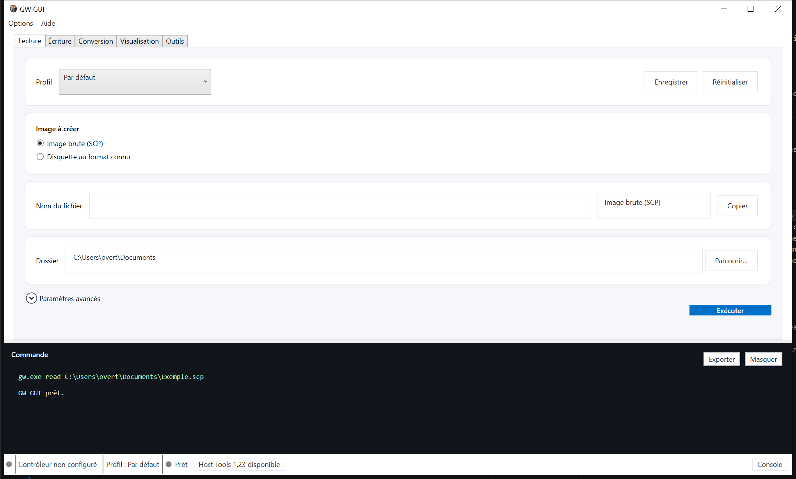

# Guide utilisateur — GW GUI

## Première configuration

1. Ouvrez **Options → Préférences**.
2. Détectez ou sélectionnez `gw.exe`. Le téléchargement intégré des Host Tools reste volontaire.
3. Dans **Matériel**, recherchez le contrôleur Greaseweazle puis décrivez chaque lecteur raccordé.
4. Définissez le dossier d’images par défaut, la langue et le thème.

Les contrôleurs et lecteurs débranchés restent mémorisés. Une nouvelle recherche n’est nécessaire que si leur port ou leur configuration change.

## Lecture

- **Image brute SCP** archive directement les flux de la disquette.
- **Disquette au format connu** décode vers ADF, ST, IMA ou un autre conteneur compatible.
- Le champ du nom ne contient pas l’extension.
- La numérotation automatique accepte chiffres ou lettres et ne progresse qu’après une lecture réussie.
- Les options techniques sont repliées dans **Paramètres avancés**.
- Le profil **Par défaut** désactive toutes les options facultatives. Sauvegarder crée un profil propre à Lecture.

En cas de fichier existant, un dialogue propose trois boutons explicites : **Écraser**, **Prendre le numéro suivant** ou **Me laisser modifier le nom**. Fermer ce dialogue ne lance rien et permet également de modifier le nom.

## Écriture

Choisissez l’image source. GW GUI détecte son format par conteneur et par taille lorsqu’il le peut; une ambiguïté doit être résolue manuellement. Un résumé obligatoire affiche le fichier, le format, le lecteur et l’état de la vérification avant l’écriture. Désactiver la vérification est une option avancée signalée comme risquée.

## Conversion

Les cases de formats servent à la conversion simple comme multiple. Les sorties incompatibles avec la source sont désactivées. Sans extension explicitement cochée, l’extension normale du format est utilisée; cocher une ou plusieurs extensions remplace ce choix implicite. Les formats sélectionnés restent épinglés en haut.

Les tags tels que `[PC-720]` ou `[AMIGA-DD]` évitent les collisions lors d’une multiconversion. Chaque sortie est exécutée séparément et le bilan final conserve les réussites même si une conversion échoue.

## Visualisation SCP

Ouvrez une capture SCP pour afficher les deux faces, zoomer, déplacer la vue et sélectionner une piste. L’inspecteur indique les révolutions, la vitesse estimée, le checksum et les structures reconnues par le décodeur automatique ou choisi.

## Explorateur de disque

La famille Apple est lisible dans l’Explorateur : Apple II DOS/ProDOS (`.dsk`, `.do`, `.po`, `.2mg` et SCP 3,5 pouces), Apple III SOS, Macintosh MFS/HFS (`.image`, `.dsk`, `.img` et SCP 400/800 Kio) et Lisa Office System dans les images DiskCopy comportant leurs tags de pages.

L’onglet **Explorateur** ouvre directement les images Amiga ADF/SCP, Atari ST/MSA/ATR/SCP, Commodore D64/D71/D81/SCP et Amstrad CPC/PCW DSK/EDSK/SCP. Il affiche en lecture seule le nom de volume lorsqu’il existe, le système de fichiers, la capacité et l’espace libre. Les systèmes actuellement interprétés sont AmigaDOS OFS/FFS, Atari TOS FAT12 et Atari DOS, Commodore CBM DOS et CP/M 3, ainsi que CP/M pour Amstrad CPC et CP/M Plus pour PCW. L’arborescence des dossiers est présentée à gauche avec des commandes `+` et `−`; le contenu du dossier sélectionné apparaît au centre avec des icônes distinctes et un type précis pour les dossiers, textes, images, sons, archives, programmes et images disque. Le panneau de droite affiche les informations du disque tant que la liste centrale n’a aucune sélection, puis celles du fichier ou dossier choisi dans cette liste. La sélection reste neutre et n’utilise pas le bleu d’accentuation. Charger une image dans l’Explorateur la prépare également dans Visualisation, et inversement, sans déplacer automatiquement l’utilisateur vers l’autre onglet. Le dernier dossier choisi est commun aux deux onglets et restauré au prochain démarrage; il ne remplace pas le dossier de destination défini pour Lecture. Si Greaseweazle ne reconnaît pas le conteneur, l’Explorateur l’ouvre avec le lecteur interne disponible sans lancer inutilement `gw convert`. Une préparation de visualisation en cours est annulée dès qu’une autre image est choisie.

Un conteneur valide dont le système de fichiers n’est pas reconnu reste ouvert avec les informations de disque disponibles et une arborescence vide; ce cas n’est pas affiché comme une erreur. Les ATR 90 Kio et 130 Kio peuvent aussi être préparés pour Visualisation. Les ATR 180 Kio restent explorables, mais Greaseweazle 1.23 ne fournit pas le profil Atari nécessaire pour les visualiser.

La détection peut rester automatique ou être forcée au moyen de la même liste de formats, dans le même ordre, que les autres fonctions de GW GUI. Les formats dont le lecteur de système de fichiers n’est pas encore réalisé sont déjà visibles mais ne peuvent pas encore produire d’arborescence. Une capture SCP terminée peut être envoyée dans l’Explorateur depuis Lecture. **Lire la disquette** demande d’abord de confirmer que la bonne disquette se trouve dans le lecteur affiché, crée avec `gw` une capture SCP temporaire, l’analyse puis la supprime automatiquement.

Les erreurs visibles sont localisées et les détails techniques complets sont conservés dans le journal d’erreurs. Les noms techniques tels que `AmigaDOS`, `OFS`, `FFS`, `Atari TOS` et `Atari DOS` ne sont pas traduits.

## Outils, diagnostics et matériel

- **Outils** contient l’effacement de disquette et le nettoyage des têtes, avec confirmation.
- **Options → Diagnostics** contient information, bande passante USB, RPM et déplacement de tête.
- **Options → Matériel** contient broches, réinitialisation, délais et firmware.

Les actions potentiellement dangereuses restent dans des dialogues séparés de l’usage courant.

## Console, arrêt et historique

La commande exacte et les sorties de `gw` sont intégrées en bas de la fenêtre et peuvent être masquées ou exportées. Le bouton **Exécuter** devient **Arrêter** pendant une opération et demande confirmation. L’historique dans le menu Options conserve dix journaux de 5 Mio maximum.

## Données et mode portable

- Installation classique : données dans les dossiers utilisateur Windows.
- ZIP portable : la présence de `portable.flag` place réglages, journaux et Host Tools gérés dans le dossier `Data` voisin de l’application.

GW GUI n’envoie aucune télémétrie.

L’Explorateur prend aussi en charge IBM PC FAT12 sur IMG, IMA et SCP, des anciennes images DOS 160 Kio sans BPB jusqu’aux géométries 2,88 Mio. La détection automatique distingue IBM PC d’Atari malgré leur utilisation commune de FAT12.
