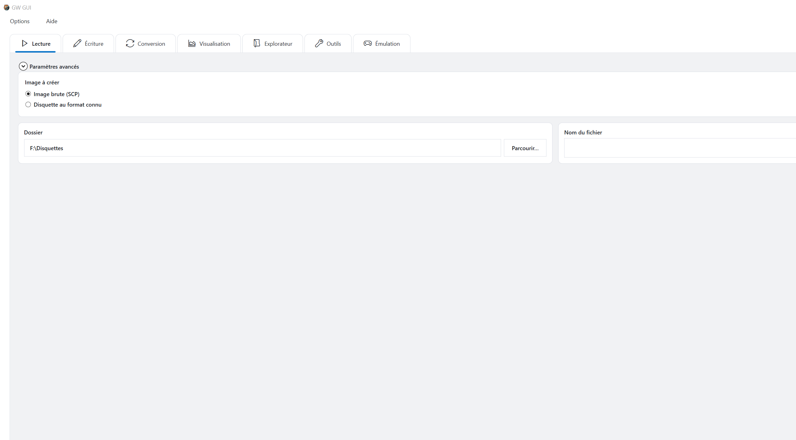

# Guide utilisateur de GW GUI

GW GUI est une application Windows permettant de lire, écrire, convertir, examiner et émuler des images de disquettes. Elle peut piloter un matériel Greaseweazle, traiter des fichiers image avec son moteur interne et exécuter des configurations de machines émulées enregistrées.

Ce guide décrit en français la version actuelle de l'application. Les captures disponibles montrent la même interface en anglais ; leur disposition et leurs commandes correspondent aux éléments français décrits dans le texte. Le document est conçu comme la source du manuel PDF imprimable : les captures illustrent les commandes, tandis que le texte explique quoi choisir, pourquoi le choisir et comment vérifier le résultat.

> **Important :** la lecture d'une disquette n'est pas destructive. L'écriture, l'effacement, la mise à jour du firmware et certains outils matériels peuvent modifier le support ou le matériel. Lisez l'avertissement de la procédure concernée avant de cliquer sur **Exécuter**.

### Comment utiliser ce guide

Pour une première utilisation, commencez par [Bien démarrer](#bien-démarrer), puis suivez [Lire une disquette](#lire-une-disquette). Si l'application est déjà configurée, allez directement au chapitre correspondant à l'opération souhaitée. Les chapitres consacrés aux options servent de référence lorsqu'une procédure demande de modifier un lecteur, un moteur, un profil ou un réglage d'émulation.

Les noms des éléments de l'interface apparaissent en **gras**. Les noms de fichiers, chemins, commandes et valeurs littérales apparaissent en `code`. Les remarques décrivent un comportement normal ; les avertissements signalent les opérations susceptibles de modifier une disquette, un contrôleur ou une configuration enregistrée.

## Sommaire

1. [Comprendre le fonctionnement général](#comprendre-le-fonctionnement-général)
2. [Bien démarrer](#bien-démarrer)
3. [Fenêtre principale](#fenêtre-principale)
4. [Lire une disquette](#lire-une-disquette)
5. [Écrire une disquette](#écrire-une-disquette)
6. [Convertir des images disque](#convertir-des-images-disque)
7. [Visualiser une image disque](#visualiser-une-image-disque)
8. [Explorer le contenu d'un disque](#explorer-le-contenu-dun-disque)
9. [Utiliser les outils](#utiliser-les-outils)
10. [Émulation](#émulation)
11. [Options de l'application](#options-de-lapplication)
12. [Options d'émulation](#options-démulation)
13. [Configuration Amiga](#configuration-amiga)
14. [Diagnostic et maintenance du matériel](#diagnostic-et-maintenance-du-matériel)
15. [Journaux et historique des opérations](#journaux-et-historique-des-opérations)
16. [Données de l'application et utilisation portable](#données-de-lapplication-et-utilisation-portable)
17. [Procédures recommandées](#procédures-recommandées)
18. [Listes de vérification de sécurité](#listes-de-vérification-de-sécurité)
19. [Dépannage](#dépannage)
20. [Glossaire](#glossaire)
21. [Référence rapide](#référence-rapide)

## Comprendre le fonctionnement général

GW GUI distingue les opérations sur une disquette physique des opérations sur un fichier image :

| Objectif | Source | Résultat | Page recommandée |
|---|---|---|---|
| Préserver une disquette | Disquette physique | Fichier image | **Lecture** |
| Recréer une disquette | Fichier image | Disquette physique | **Écriture** |
| Changer le format d'une image | Fichier image | Une ou plusieurs images | **Conversion** |
| Examiner les pistes et anomalies | Fichier image | Analyse visuelle | **Visualisation** |
| Parcourir les fichiers d'une image | Image et système de fichiers pris en charge | Fichiers et dossiers | **Explorateur de disque** |
| Diagnostiquer un lecteur ou contrôleur | Matériel Greaseweazle | Mesures ou état | **Outils** |
| Exécuter une machine virtuelle enregistrée | Configuration de machine | Session d'émulation | **Émulation** |

Pour une conservation durable, réalisez d'abord une capture brute et gardez-la intacte comme image maître. Créez les conversions et les copies réparées à partir de ce maître. Vous évitez ainsi de relire inutilement le support physique et conservez des informations qu'un format sectoriel ne peut pas toujours représenter.

## Bien démarrer

### Prérequis

- Windows avec la version de Microsoft .NET Desktop Runtime demandée par l'application.
- Un contrôleur Greaseweazle pour les opérations sur des disquettes physiques.
- Un chemin valide vers `gw.exe` si le moteur Greaseweazle Host Tools est utilisé.
- Des fichiers ROM obtenus légalement lorsque la machine émulée les exige.

Au démarrage, l'application vérifie la présence de la version nécessaire de .NET. Si elle manque, suivez la demande d'installation, puis relancez GW GUI.

### Avant de connecter le matériel

Vérifiez les points suivants avant toute opération physique :

1. Branchez le contrôleur Greaseweazle sur un port USB stable.
2. Vérifiez l'orientation de la nappe du lecteur de disquettes.
3. Branchez correctement l'alimentation du lecteur avant d'insérer un support précieux.
4. Confirmez que la taille et la densité du lecteur correspondent à la disquette.
5. Protégez la disquette source contre l'écriture lorsque c'est possible.

GW GUI ne peut pas empêcher les dommages causés par un câblage incorrect, une alimentation inadaptée ou un lecteur mécaniquement dangereux. Testez d'abord tout matériel inconnu avec une disquette sans valeur.

### Premier démarrage

1. Ouvrez `gwgui.exe`.
2. Ouvrez **Options**.
3. Dans **Contrôleurs et lecteurs**, recherchez le contrôleur et configurez le lecteur.
4. Vérifiez ou sélectionnez le chemin vers `gw.exe`.
5. Dans **Moteurs**, choisissez le moteur utilisé pour chaque opération.
6. Revenez à la fenêtre principale et choisissez l'onglet voulu.

### Vérifier que la configuration est prête

Une configuration fonctionnelle doit afficher le contrôleur et le lecteur dans la barre d'état, par exemple le numéro du lecteur, sa taille, sa densité et son port COM. Dans **Options > Contrôleurs et lecteurs**, le contrôleur doit apparaître comme **Disponible** et le lecteur comme **Configuré**. Avant de lire un support précieux, lancez **Informations sur le contrôleur** pour vérifier la communication sans modifier la disquette.

### Choisir un moteur

GW GUI peut proposer plusieurs implémentations pour certaines opérations. **Greaseweazle Host Tools** exécute le fichier `gw.exe` configuré ; le moteur interne de GW GUI traite directement les opérations qu'il prend en charge. Le choix est indépendant pour la lecture, l'écriture, la conversion et l'Explorateur de disque. Si le moteur choisi ne sait pas réaliser une opération, GW GUI le signale au lieu de changer silencieusement de moteur.

## Fenêtre principale

La fenêtre principale regroupe sept familles d'opérations :

- **Lecture** crée une image à partir d'une disquette physique.
- **Écriture** écrit une image sur une disquette physique.
- **Conversion** transforme une image dans un ou plusieurs formats.
- **Visualisation** affiche les pistes, le flux et les données décodées.
- **Explorateur de disque** parcourt les systèmes de fichiers pris en charge.
- **Outils** donne accès à la maintenance et aux diagnostics.
- **Émulation** gère et démarre les machines enregistrées.

La console inférieure affiche la commande exécutée et son résultat. La barre d'état indique le lecteur sélectionné, le profil actif et l'état courant.

### Lire l'interface

La plupart des pages d'opération suivent la même organisation :

1. Les commandes de **source ou destination** identifient la disquette, l'image ou le dossier.
2. Les commandes de **format** utilisent la détection automatique ou un choix explicite de machine et de format.
3. Les **profils** appliquent des réglages réutilisables.
4. Les **paramètres avancés** exposent les options normalement facultatives.
5. **Exécuter** démarre l'opération.
6. La **console** montre la commande générée, la progression, les avertissements et les erreurs.

La présence du bouton **Exécuter** ne signifie pas que les valeurs sont sûres pour la disquette insérée. Avant une écriture ou une opération de maintenance, relisez toujours la destination et le lecteur sélectionné.

### Barre d'état et console

La partie gauche de la barre d'état identifie le lecteur physique actif. Le centre affiche le profil lorsqu'un profil est sélectionné. L'indicateur d'état précise si l'application est prête ou occupée. La console constitue la trace de référence de la commande transmise au moteur. Utilisez son bouton de copie pour conserver ou partager cette commande.

## Lire une disquette

Ouvrez l'onglet **Lecture** pour capturer une disquette physique sous forme de fichier image.

### Procédure de base

1. Insérez la disquette source dans le lecteur configuré.
2. Choisissez le type d'image :
   - **Image brute (SCP)** conserve les informations de flux.
   - **Format de disque connu** crée une image selon une machine et un format choisis.
3. Choisissez le dossier de destination.
4. Saisissez le nom du fichier.
5. Sélectionnez un profil si nécessaire.
6. Cliquez sur **Exécuter**.

La console affiche la commande exacte et la progression. Ne retirez pas la disquette et ne débranchez pas le contrôleur avant la fin de l'opération.

### Choisir le type de sortie

Utilisez **Image brute (SCP)** pour l'archivage, l'analyse, la récupération ou une conversion ultérieure. Une image brute conserve la chronologie du flux et plusieurs révolutions, ce qui est utile pour les formats inhabituels, les secteurs faibles, les protections et les supports endommagés.

Utilisez **Format de disque connu** lorsque la famille du disque est certaine et qu'une image sectorielle directement exploitable est nécessaire. Elle est souvent plus petite et plus facile à ouvrir dans d'autres logiciels, mais elle représente le résultat décodé et non tous les détails observés par le lecteur.

En cas de doute, créez d'abord l'image brute. Vous pourrez la convertir sans relire la disquette.

### Dossier, nom de fichier et profil

Le **Dossier** désigne le répertoire de destination. Le **Nom du fichier** doit identifier la disquette sans dépendre uniquement de son étiquette physique. Un bon nom d'archive indique le titre, le numéro de disque ou la face, ainsi que l'état du support si nécessaire. N'ajoutez pas une extension incompatible avec le format sélectionné.

Un **Profil** applique un ensemble de réglages de lecture enregistré. Ne choisissez un profil spécialisé que si son contenu est connu. Le profil **Par défaut** convient à un premier essai normal ; un profil de récupération peut lire davantage de révolutions ou une autre plage de pistes et prendra donc plus de temps.

### Paramètres avancés

Dépliez **Paramètres avancés** pour accéder aux options propres au format et aux options expertes. Conservez les valeurs par défaut tant qu'une plage de pistes, un nombre de révolutions ou une option particulière du contrôleur n'est pas nécessaire.

| Paramètre | Rôle | Quand le modifier |
|---|---|---|
| Plage de pistes | Limite les cylindres et les têtes lus | Support simple face, géométrie inhabituelle ou récupération ciblée |
| Révolutions | Définit le nombre de rotations échantillonnées | Augmenter pour une piste instable ou protégée |
| Arguments experts | Transmet des paramètres supplémentaires au moteur | Uniquement en suivant une documentation Greaseweazle précise |

### Vérifier une lecture réussie

Ne vous fiez pas seulement à l'absence de boîte d'erreur. Après la commande :

1. Vérifiez que le fichier existe et n'est pas vide.
2. Lisez les dernières lignes de la console pour repérer les pistes absentes ou en échec.
3. Ouvrez l'image dans **Visualisation** et vérifiez les deux faces et la plage de pistes attendue.
4. Ouvrez-la dans **Explorateur de disque** si le système de fichiers est pris en charge.
5. Conservez le journal avec les captures d'archive importantes.

Si plusieurs lectures donnent des résultats différents, conservez chaque capture brute sous un nom distinct. Ces différences peuvent aider à la récupération.

## Écrire une disquette

Ouvrez l'onglet **Écriture** pour inscrire une image existante sur une disquette physique.

### Procédure de base

1. Insérez la disquette de destination.
2. Sélectionnez l'image source avec **Parcourir**.
3. Confirmez le format détecté.
4. Sélectionnez un profil si nécessaire.
5. Cliquez sur **Exécuter**.

L'écriture remplace les données de la disquette de destination. Vérifiez le lecteur et l'image avant de commencer.

> **Avertissement :** l'écriture est destructive. Utilisez si possible une archive source protégée contre l'écriture et une disquette de destination séparée.

### Avant l'écriture

Contrôlez quatre éléments :

1. **Image :** le chemin désigne bien l'image source voulue.
2. **Disquette :** le support inséré peut être écrasé sans risque.
3. **Lecteur :** sa taille et sa densité conviennent au support.
4. **Format :** la détection automatique ou le choix manuel correspond à l'image.

Si l'image source n'a jamais été testée, ouvrez-la d'abord dans **Visualisation** ou **Explorateur de disque**. Une écriture réussie ne répare pas une image source incomplète.

### Inspection et modification des pistes

Après la sélection d'une image, **Visualiser les pistes** ouvre sa représentation graphique. **Modifier** expose les transformations compatibles avant l'écriture. Les actions disponibles dépendent du format et du moteur.

### Vérifier la disquette écrite

Utilisez la vérification du moteur lorsqu'elle est disponible. Sinon, relisez la disquette vers une nouvelle image et comparez son contenu décodé ou examinez-la dans **Visualisation**. Ne remplacez jamais l'image source par l'image de vérification.

Un échec toujours situé sur les mêmes pistes peut indiquer un problème de support, de densité ou de propreté du lecteur. Des échecs aléatoires orientent plutôt vers la liaison USB ou la communication avec le contrôleur.

## Convertir des images disque

L'onglet **Conversion** transforme une image source dans un ou plusieurs formats de destination.

### Procédure de base

1. Sélectionnez l'image source.
2. Indiquez éventuellement les noms de sortie.
3. Choisissez une famille de machines.
4. Sélectionnez un ou plusieurs formats et extensions de sortie.
5. Activez **Ajouter des balises** si les noms doivent suivre le modèle configuré.
6. Cliquez sur **Exécuter**.

Le panneau **Sélection** récapitule les sorties demandées. **Migration de fichiers** ouvre la procédure dédiée au transfert des fichiers pris en charge, différente d'une conversion classique de l'image entière.

### Choisir les formats

La liste **Machine** filtre les formats proposés. Un nom de format décrit l'organisation logique du disque ; l'extension décrit le conteneur de sortie. Certains formats acceptent plusieurs extensions et certains conteneurs ne peuvent pas conserver toutes les caractéristiques d'une source brute.

Ne sélectionnez que les sorties réellement nécessaires. Plusieurs formats sont utiles pour produire simultanément un maître d'archive, une copie compatible avec un émulateur et une copie destinée à un outil d'analyse.

### Nommage et balises

**Noms de sortie** contrôle les noms de base. **Ajouter des balises** applique le modèle défini dans **Options > Général**. Les balises peuvent contenir la famille, le format, l'extension, la date ou l'heure. Vérifiez l'exemple avant une conversion en série.

### Contrôler les résultats

Pour chaque sortie :

1. Confirmez que le fichier a été créé.
2. Vérifiez dans la console si des pistes ou secteurs n'ont pas été décodés.
3. Ouvrez le résultat dans **Explorateur de disque** si son système de fichiers est reconnu.
4. Comparez la capacité et le contenu attendus avec la source.

Une conversion peut se terminer tout en signalant une perte d'information inhérente au format cible. Conservez toujours l'image brute d'origine.

## Visualiser une image disque

L'onglet **Visualisation** présente la structure et la répartition des données d'une image.

1. Cliquez sur **Ouvrir une image disque**.
2. Conservez **Détection automatique**, ou choisissez manuellement la machine et le format.
3. Utilisez **Lier le zoom** pour appliquer la même échelle aux deux faces.
4. Utilisez **Réinitialiser** pour retrouver la vue initiale.
5. Ouvrez **Inspecteur** pour détailler la zone sélectionnée.

La légende distingue le flux normal, les transitions courtes et longues, les en-têtes, les données décodées et les anomalies. Une image brute peut contenir des données impossibles à convertir en système de fichiers connu tout en restant analysable ici.

### Interpréter la vue

Chaque grand disque représente une face. Le centre identifie la face et l'état actuel des données ; les positions concentriques correspondent aux pistes. Les couleurs classent les zones détectées. Cette vue permet notamment de déterminer :

- si une ou deux faces contiennent des données ;
- si toutes les pistes attendues sont présentes ;
- si les anomalies sont isolées ou répétées ;
- si la machine et le format détectés semblent plausibles.

Une couleur d'anomalie justifie une inspection, mais ne prouve pas que la disquette est inutilisable. Une protection, un format non standard, un enregistrement faible ou un secteur endommagé produisent des structures différentes.

### Méthode d'inspection conseillée

Commencez avec le zoom lié pour comparer les faces à la même échelle. Sélectionnez une zone suspecte, ouvrez **Inspecteur** et comparez-la aux pistes voisines. Si le problème semble venir de la détection, désactivez temporairement le mode automatique et forcez une machine et un format connus. Réactivez ensuite la détection automatique pour ne pas réutiliser ce choix sur une autre image.

## Explorer le contenu d'un disque

L'onglet **Explorateur de disque** parcourt les images compatibles sous forme d'arborescence.

1. Ouvrez une image existante ou lisez une disquette.
2. Conservez **Détection automatique**, sauf si la machine et le format doivent être imposés.
3. Examinez le volume, le système, la protection, le système de fichiers, la capacité, l'espace libre et le nombre d'éléments.
4. Parcourez les dossiers dans le panneau gauche.
5. Sélectionnez un élément pour afficher ses détails à droite.

La zone supérieure résume l'image montée et le volume détecté. Le panneau inférieur gauche contient l'arborescence ; le tableau central affiche le nom, la date, le type et la taille ; le panneau droit détaille l'élément sélectionné.

Un explorateur vide ne signifie pas nécessairement que l'image est vide. Le système de fichiers peut être endommagé ou non pris en charge alors que **Visualisation** montre bien des données enregistrées. Ne supprimez jamais la source sur la seule base d'un explorateur vide.

## Utiliser les outils

L'onglet **Outils** rassemble les opérations de maintenance Greaseweazle.

Choisissez une commande dans la liste de gauche, contrôlez ses paramètres, puis cliquez sur **Exécuter**. Les commandes destructives ou modifiant le matériel ne doivent être lancées qu'après vérification du contrôleur et du lecteur.

La plupart des boîtes d'outils comportent les paramètres en haut, l'état et la sortie brute au centre, puis un aperçu de la commande en bas. Une case décochée signifie généralement que la valeur ne sera pas modifiée ; une case cochée ajoute cette valeur à la commande.

Les outils sont détaillés dans [Diagnostic et maintenance du matériel](#diagnostic-et-maintenance-du-matériel).

## Émulation

### Ouvrir une machine enregistrée

L'onglet **Émulation** affiche les configurations enregistrées. Sélectionnez-en une et cliquez sur **Ouvrir**. Chaque machine en cours d'exécution possède son propre onglet.

Si aucune configuration n'apparaît, créez-en une dans les Options. Une configuration associe le modèle, la version de l'émulateur, la ROM, la mémoire, la vidéo, le son, le stockage et les commandes. L'enregistrer ne la démarre pas : revenez dans **Émulation** et cliquez sur **Ouvrir**.

### Commandes d'une machine en cours d'exécution

La barre d'outils propose l'alimentation, la pause, les réinitialisations, les états rapides, les captures et l'affichage. Elle indique également :

- les raccourcis d'enregistrement et de chargement rapide ;
- le moteur de rendu actif, par exemple Direct3D 11 ;
- les raccourcis du plein écran et de libération de la souris ;
- l'état du son, de la manette et de la souris ;
- la résolution, la fréquence et le nombre d'images par seconde.

La bande inférieure gère les supports amovibles de chaque lecteur émulé. Les raccourcis globaux se règlent dans **Options > Émulation > Raccourcis** ; le clavier, la souris et les manettes de la machine se règlent dans les onglets Amiga correspondants.

### Référence de la barre d'outils

| Groupe | Fonction |
|---|---|
| Alimentation et pause | Démarre, arrête, suspend ou reprend la machine |
| Réinitialisations | Effectue la réinitialisation logicielle ou matérielle configurée |
| États | Enregistre ou recharge rapidement l'état de l'émulateur |
| Capture | Enregistre une image de l'affichage émulé |
| Affichage | Modifie la présentation ou passe en plein écran |
| Rappel des états rapides | Affiche les raccourcis de sauvegarde et chargement |
| Moteur de rendu | Indique le backend vidéo actif |
| Rappel des commandes | Affiche les touches du plein écran et de libération de la souris |
| Périphériques | Indique l'état du son, des manettes et de la souris |
| Performances | Indique la taille, la fréquence et le nombre d'images par seconde |

### Quitter le plein écran et libérer la souris

La barre affiche les raccourcis actuellement assignés. Dans l'exemple, **Alt+Entrée** bascule le plein écran et **F12** libère la souris. Fiez-vous aux valeurs affichées, car elles peuvent être reconfigurées.

### Utiliser les disquettes émulées

La bande des lecteurs identifie les lecteurs comme `DF0:`. Utilisez ses commandes pour insérer, remplacer ou éjecter une image. Le remplacement du support modifie la disquette insérée dans la session ; il ne change pas automatiquement la définition permanente du périphérique.

## Options de l'application

Ouvrez **Options** depuis la fenêtre principale.

### Général

L'onglet **Général** contient :

- le dossier d'images disque par défaut ;
- la langue et le thème ;
- la génération des balises de nom pour les conversions ;
- les modèles prédéfinis et les modèles personnalisés récents ;
- un exemple actualisé du nom produit.

Les variables incluent le nom de la source, la famille, le format, l'extension, la date et l'heure. L'aperçu permet de détecter les séparateurs en double, les extensions manquantes et les noms ambigus avant la création de fichiers.

### Journaux

La journalisation se règle séparément pour chaque opération. Choisissez si les journaux sont enregistrés, fixez une taille maximale et indiquez s'il faut conserver les journaux précédents. Une taille de `0` signifie illimitée. **Ouvrir le dossier** affiche le répertoire courant.

Conservez les journaux précédents pour l'archivage et les diagnostics nécessitant la comparaison de plusieurs tentatives. La limite de taille concerne les journaux, pas les images de disquette.

### Contrôleurs et lecteurs

Cette page permet de rechercher les contrôleurs, d'ajouter ou retirer un lecteur, de choisir sa taille, sa densité et sa vitesse, d'enregistrer les réglages matériels et de gérer le chemin de `gw.exe`.

#### Ajouter un lecteur

1. Cliquez sur **Rechercher** et attendez l'apparition du contrôleur.
2. Cliquez sur **Ajouter un lecteur** si nécessaire.
3. Choisissez son numéro logique, sa taille, sa densité et sa vitesse de rotation.
4. Enregistrez la ligne.
5. Vérifiez les états **Disponible** et **Configuré**.

La corbeille supprime la configuration enregistrée ; elle ne débranche pas le matériel. Si le port COM change, effectuez une nouvelle recherche.

#### Gérer Greaseweazle Host Tools

**Trouver gw.exe** recherche les emplacements connus. **Choisir** sélectionne un exécutable précis. **Rechercher les mises à jour** interroge les versions disponibles sans remplacer l'installation. **Télécharger la dernière version** installe la version sélectionnée et **Utiliser le chemin précédent** restaure l'ancien emplacement. Après un changement, lancez **Informations sur le contrôleur**.

### Moteurs

Choisissez indépendamment le moteur de lecture, d'écriture, de conversion et d'exploration. Le moteur sélectionné est utilisé strictement : s'il ne sait pas effectuer l'opération, GW GUI le signale sans basculer silencieusement vers un autre moteur.

Cette séparation permet par exemple d'utiliser Host Tools pour le matériel et le moteur interne pour la conversion. Notez les moteurs utilisés lorsqu'une procédure doit être reproductible.

### Profils

Les profils mémorisent des réglages de lecture, d'écriture et de conversion. Donnez-leur un nom décrivant leur usage, le lecteur, la famille du disque ou la méthode de récupération. Après une mise à jour du moteur, vérifiez les profils qui contiennent des options expertes.

## Options d'émulation

Les options d'émulation contiennent les dossiers généraux, les raccourcis globaux, les configurations enregistrées et les réglages propres à la machine.

### Dossiers généraux d'émulation

Définissez le dossier de stockage partagé, le dossier des captures et celui des états enregistrés. Une capture est une image ordinaire ; un état enregistré contient l'état interne de l'émulateur et peut dépendre de la version et de la configuration qui l'ont créé. Sauvegardez la configuration et les supports avec les états importants.

### Raccourcis globaux

Recherchez une action, assignez ou retirez une combinaison, restaurez les valeurs par défaut et supprimez les conflits. Pour modifier un raccourci, cliquez sur **Assigner**, pressez la combinaison souhaitée, puis contrôlez son état. **Effacer les conflits** retire les associations conflictuelles ; **Restaurer les valeurs par défaut** remplace les personnalisations par le jeu standard.

### Configurations enregistrées

Cette page liste les machines enregistrées. Sélectionnez-en une pour la modifier dans l'onglet **Amiga**. Vous pouvez actualiser la liste ou supprimer la configuration sélectionnée.

La suppression retire la définition de la machine. Elle ne sert pas à éjecter un support ni à fermer une machine en cours d'exécution. Avant la suppression, notez les ROM, images de disque dur et états associés.

## Configuration Amiga

L'interface actuelle propose des pages détaillées pour l'Amiga. La même organisation pourra être étendue à d'autres systèmes émulés sans modifier le fonctionnement principal.

### Général

Choisissez d'abord le modèle, car il détermine les processeurs, mémoires, ROM, chipsets et périphériques disponibles. Installez ou remplacez la version de l'émulateur, définissez les dossiers des supports, puis enregistrez la configuration avant de la lancer.

**Rechercher les versions** interroge la source officielle. Installer une autre version remplace celle utilisée par la configuration ; cela ne crée pas une deuxième copie de la machine.

### Processeur

- **Modèle de processeur** identifie le processeur émulé.
- **Précision** contrôle le modèle temporel. Le mode cycle exact privilégie la compatibilité matérielle mais demande davantage de calcul.
- **FPU** active une unité de calcul flottant compatible lorsqu'elle est disponible.
- **Vitesse du processeur** sélectionne la vitesse d'origine ou une accélération.

Pour une configuration de référence, gardez le processeur déterminé par le modèle et la vitesse d'origine. N'activez l'accélération qu'après un démarrage correct avec les valeurs standard.

### Mémoire

**Chip RAM** est accessible aux circuits spécialisés et indispensable à la machine. **Slow RAM** représente une extension courante. **Fast RAM** est destinée principalement au processeur. **Zorro III RAM** n'est disponible que sur les modèles compatibles avec cette architecture. Les messages de compatibilité et les champs désactivés empêchent les combinaisons impossibles. Le total configuré est affiché en bas.

### ROM

Choisissez la ROM Kickstart, l'éventuelle ROM étendue et la clé ROM. La liste détectée affiche les noms, révisions et niveaux de compatibilité. Sélectionnez une ROM puis cliquez sur **Utiliser**, ou choisissez manuellement un fichier.

Les ROM ne sont pas fournies par GW GUI. Utilisez uniquement des fichiers que vous êtes légalement autorisé à employer.

La liste détectée est plus fiable que le seul nom du fichier. **Compatible** correspond au choix normal ; **Partiellement compatible** indique que la ROM peut fonctionner sans correspondre exactement au modèle. **Actualiser** relance la recherche dans les emplacements configurés.

### Vidéo

| Paramètre | Effet pratique |
|---|---|
| Standard vidéo | Sélectionne la chronologie PAL ou NTSC |
| Rapport d'aspect | Définit la mise à l'échelle de l'image |
| Résolution | Choisit automatiquement ou explicitement le niveau de détail |
| Mode de lignes | Traite l'entrelacement et le doublage des lignes |
| Rogner les bordures | Retire la zone d'overscan inutilisée lorsque l'option est activée |
| Rendu | Sélectionne le backend graphique |
| Profondeur de couleur | Définit la précision des couleurs |
| Saut d'images | Réduit le nombre d'images rendues |
| Gamma | Ajuste la réponse de luminosité |
| Correction du scintillement | Traite les modes qui scintillent visiblement |

Modifiez un seul réglage à la fois. Si l'affichage devient noir ou instable, revenez à la résolution automatique, au saut d'images désactivé, au gamma neutre et au dernier moteur de rendu fonctionnel.

### Audio

Activez le son, choisissez le périphérique et la latence, puis configurez l'interpolation, le filtre Amiga, la séparation stéréo, le bruit des lecteurs et le volume CD.

Une latence faible réduit le retard mais peut provoquer des coupures. Augmentez-la si le son craque. L'interpolation et le filtre modifient la restitution sonore, pas la logique du programme émulé. Le volume du lecteur contrôle séparément les bruits mécaniques simulés.

### Stockage

La page liste l'identifiant, le type, le modèle, le support associé et les actions disponibles. Ajoutez, configurez ou supprimez les périphériques ici. Les disquettes et CD peuvent être insérés ou remplacés depuis la machine en fonctionnement.

L'identifiant est le nom vu par la machine. Le type distingue lecteurs de disquettes, disques durs, lecteurs optiques et autres périphériques. Le modèle décrit le matériel émulé et le support associé désigne l'image montée. Sauvegardez les images de disque dur avant toute utilisation en écriture.

### Clavier

Recherchez une touche Amiga et son association hôte, assignez ou retirez une touche, restaurez les valeurs par défaut et résolvez les conflits. Une association valide peut malgré tout entrer en concurrence avec Windows ou un raccourci global ; testez les combinaisons importantes dans la machine.

Évitez d'affecter le raccourci de libération de la souris ou du plein écran à une touche fréquemment utilisée par le logiciel émulé.

### Souris

Réglez la vitesse de la souris physique, choisissez le ou les sticks analogiques qui déplacent le pointeur, puis ajustez la zone morte et la vitesse de chaque stick. Augmentez la zone morte si le pointeur dérive. La table inférieure associe les entrées de l'hôte aux boutons et actions de la souris ; vérifiez les conflits après toute modification des manettes.

### Manettes

Détectez les manettes, affectez un périphérique et un type à chaque port, puis configurez les associations et le tir automatique. Les ports 1 et 2 sont indépendants. **Automatique** constitue un bon point de départ, mais certains logiciels nécessitent explicitement une souris ou un joystick. Le tir automatique doit rester désactivé sauf besoin précis.

## Diagnostic et maintenance du matériel

Ces boîtes sont ouvertes depuis **Outils**. Chacune affiche la commande Greaseweazle générée. Relisez-la avant de cliquer sur **Exécuter**.

### Informations sur le contrôleur

Cette commande affiche les informations fournies par le contrôleur. Utilisez-la comme premier diagnostic : une réponse correcte confirme que GW GUI peut démarrer Host Tools et communiquer avec le périphérique. Notez le matériel et la version du firmware avant une mise à jour.

### Bande passante USB

Mesurez la bande passante disponible pour diagnostiquer une liaison instable, un câble ou un concentrateur inadapté. Fermez les autres logiciels utilisant le contrôleur et répétez la mesure après chaque changement de port ou de câble. Comparez les résultats dans des conditions similaires.

### Vitesse du lecteur

Une mesure unique donne un contrôle rapide ; plusieurs mesures révèlent la stabilité de la rotation. Laissez le lecteur atteindre sa vitesse normale. Une valeur inattendue peut venir d'une vitesse configurée incorrectement, d'un problème mécanique ou du montage de mesure.

### Déplacer la tête

Cette commande déplace la tête vers le cylindre demandé. **Autoriser les cylindres extrêmes** permet des positions normalement limitées ; **Garder le moteur actif** laisse tourner le moteur. Arrêtez en cas de chocs répétés anormaux. Cette opération ne lit pas et ne valide pas les données du cylindre atteint.

### Diagnostic d'alignement

Le diagnostic répète des lectures afin d'analyser l'alignement. Il accepte les pistes alternées, le nombre de révolutions, le nombre de lectures, le format de décodage, le flux brut, l'index, la vitesse, la PLL, la broche de densité, les secteurs matériels, TG43 et l'inversion des données.

Commencez avec une disquette de référence connue et un minimum d'options forcées. Les réglages de faux index, secteurs matériels, PLL, broches et TG43 sont spécifiques à certains matériels ou formats et peuvent invalider la comparaison s'ils sont mal employés.

### Broches matérielles

Cette boîte lit ou modifie une broche compatible du contrôleur. Avec **Modifier la broche** décoché, la commande interroge seulement son état : c'est le mode le plus sûr. Une modification agit directement sur les entrées-sorties ; elle exige la documentation exacte du contrôleur et du câblage.

### Réinitialiser le contrôleur

Réinitialisez le contrôleur lorsqu'il est détecté mais ne répond plus normalement. Attendez la fin de toute opération disque. Après la réinitialisation, relancez la détection si la connexion ne revient pas automatiquement. Cette commande ne corrige ni un chemin `gw.exe` erroné ni un câble débranché.

### Délais

Lisez ou modifiez les délais de sélection, de déplacement de tête, de stabilisation, du moteur, de désélection automatique, d'écriture et de masque d'index. Une case décochée laisse la valeur correspondante inchangée. Notez les valeurs existantes avant toute modification et testez avec un support sans valeur.

### Firmware

Mettez à jour le firmware du contrôleur. **Mettre à jour le bootloader** est explicitement risqué et doit rester désactivé sauf indication de la procédure officielle. Utilisez une liaison USB directe et stable, fermez les autres logiciels et ne débranchez jamais le contrôleur pendant l'opération. Vérifiez ensuite la version avec **Informations sur le contrôleur**.

## Journaux et historique des opérations

Ouvrez l'historique pour consulter les journaux enregistrés par type d'opération.

Sélectionnez un journal à gauche pour afficher son contenu. **Exporter** enregistre une copie destinée au diagnostic ou à l'assistance. Les chemins et commandes peuvent contenir des noms de dossiers personnels : relisez les journaux avant de les partager.

La console de la fenêtre principale montre la commande actuelle et les sorties récentes. Son bouton de copie place le texte affiché dans le presse-papiers.

### Lire un journal

Un journal utile contient la commande, les horodatages, la sortie du moteur et l'état final. Commencez par le bas pour identifier l'erreur finale, puis remontez jusqu'au premier avertissement ou à la première piste en échec. Une erreur générique tardive n'est souvent que la conséquence d'un message précédent plus précis.

Pour comparer deux tentatives, vérifiez que le contrôleur, le lecteur, le moteur, le profil, le chemin source, le format et les arguments experts étaient identiques. Sinon, la différence peut venir des paramètres et non de l'instabilité du support.

## Données de l'application et utilisation portable

GW GUI sépare les données de l'utilisateur des binaires de l'application. Selon le paquet et le mode choisis, les réglages, journaux, outils téléchargés, composants d'émulation, captures, états et configurations sont placés dans le dossier `Data` de l'application ou dans les emplacements utilisateur configurés.

Avant de déplacer ou remplacer une installation portable, conservez tout le dossier de l'application et sauvegardez `Data`. Ne déplacez pas individuellement les fichiers du dossier `lib`, car l'application recherche ses bibliothèques internes et tierces selon cette organisation.

### Éléments à sauvegarder

- les réglages et profils de l'application ;
- les définitions de contrôleurs et lecteurs ;
- les configurations d'émulation ;
- les chemins des ROM et les sauvegardes légales correspondantes ;
- les images de disquettes et de disques durs ;
- les captures et états enregistrés ;
- les journaux servant de preuve d'archivage.

Les images disque peuvent être bien plus volumineuses que les réglages. Placez les maîtres d'archive en lecture seule lorsque c'est possible et travaillez sur des copies.

## Procédures recommandées

### Archiver une disquette inconnue

1. Inspectez et nettoyez le lecteur selon une procédure adaptée.
2. Protégez la disquette contre l'écriture si possible.
3. Sélectionnez **Lecture > Image brute (SCP)**.
4. Choisissez un nom descriptif et lisez la plage normale avec plusieurs révolutions.
5. Contrôlez la console et le journal enregistré.
6. Examinez les deux faces dans **Visualisation**.
7. Convertissez une copie vers les formats sectoriels vraisemblables.
8. Testez ces copies dans **Explorateur de disque** ou un logiciel approprié.
9. Conservez ensemble le maître brut, le journal et vos notes.

### Recréer une disquette depuis une image

1. Examinez l'image et confirmez sa famille et son format.
2. Insérez une disquette volontairement réinscriptible de taille et densité correctes.
3. Ouvrez **Écriture** et sélectionnez l'image.
4. Confirmez le lecteur et le format détecté.
5. Écrivez la disquette.
6. Relisez-la dans une image de vérification séparée.
7. Comparez le contenu décodé et inspectez les pistes suspectes.

### Créer un Amiga émulé

1. Ouvrez **Options > Émulation > Configurations** et créez ou sélectionnez une machine.
2. Dans **Amiga > Général**, choisissez le modèle et la version de l'émulateur.
3. Affectez une ROM compatible obtenue légalement.
4. Conservez d'abord les valeurs du modèle pour le processeur et la mémoire.
5. Réglez la vidéo et le son avec des valeurs automatiques prudentes.
6. Ajoutez les périphériques de stockage et associez des copies des supports.
7. Vérifiez le clavier, la souris et les manettes.
8. Enregistrez la configuration.
9. Revenez dans **Émulation**, sélectionnez-la et cliquez sur **Ouvrir**.
10. Après un démarrage normal, modifiez les options avancées une par une.

## Listes de vérification de sécurité

Avant une **Lecture** :

- la bonne disquette source se trouve dans le bon lecteur ;
- la source est protégée contre l'écriture lorsque c'est possible ;
- le chemin de sortie n'écrase pas un maître existant ;
- le profil et la plage de pistes correspondent au support.

Avant une **Écriture** ou un **Effacement** :

- la disquette de destination peut être détruite ;
- l'image et le lecteur sont corrects ;
- la taille et la densité sont compatibles ;
- aucun maître d'archive n'est utilisé comme destination.

Avant un outil modifiant le matériel :

- aucune autre opération n'est en cours ;
- le bon contrôleur est sélectionné ;
- les valeurs actuelles ont été notées ;
- l'alimentation et l'USB sont stables ;
- l'action est conforme à la documentation matérielle.

## Dépannage

### Le contrôleur n'apparaît pas

1. Rebranchez-le directement sur l'ordinateur.
2. Ouvrez **Options > Contrôleurs et lecteurs**.
3. Cliquez sur **Rechercher**.
4. Vérifiez l'état du contrôleur et la configuration du lecteur.
5. Lancez **Informations sur le contrôleur** s'il est détecté mais que les commandes échouent.

Essayez ensuite un autre câble et un autre port USB. Vérifiez dans le Gestionnaire de périphériques Windows qu'un port série est apparu. Un périphérique visible dans Windows mais absent de GW GUI suggère un port occupé, une configuration périmée ou un problème Host Tools ; un périphérique absent de Windows indique plutôt un problème USB, d'alimentation, de pilote ou de matériel.

### `gw.exe` est introuvable

Dans **Options > Contrôleurs et lecteurs**, utilisez **Trouver gw.exe**, **Choisir** ou **Télécharger la dernière version**. Confirmez que le chemin désigne l'installation voulue, puis lancez **Informations sur le contrôleur**. Un échec avant tout accès matériel peut signaler un exécutable invalide, des fichiers manquants ou une version impossible à démarrer.

### Une opération utilise le mauvais moteur

Ouvrez **Options > Moteurs** et contrôlez précisément l'opération concernée. Les choix sont séparés : modifier le moteur de conversion ne modifie pas la lecture, l'écriture ou l'Explorateur. Rouvrez l'opération après l'enregistrement et contrôlez la commande générée.

### Une image n'est pas reconnue

Ne désactivez la détection automatique que si la machine et le format sont connus. Sinon, ouvrez **Visualisation**. Déterminez si la source est une capture de flux, une image sectorielle, un conteneur compressé ou un fichier sans rapport portant une extension trompeuse. Renommer une extension ne convertit pas la structure interne.

### L'émulation ne démarre pas

Vérifiez la configuration, la version installée de l'émulateur, la ROM, les chemins des supports et la compatibilité du modèle. Revenez temporairement à une configuration simple pour le processeur, la mémoire, la vidéo et le stockage. Si elle démarre, rétablissez les personnalisations une à une. Un état sauvegardé avec une autre version peut échouer alors qu'un démarrage normal fonctionne.

### Un raccourci ou une entrée ne fonctionne pas

Contrôlez les raccourcis globaux et les pages Clavier, Souris et Manettes de la machine. Résolvez chaque conflit. Si la souris est capturée, utilisez le raccourci affiché dans la barre de la machine. Relancez la détection après avoir connecté une nouvelle manette.

### Une commande échoue sans explication claire

1. Lisez la console en direct.
2. Ouvrez l'historique pour obtenir le journal complet.
3. Vérifiez le contrôleur, le lecteur, le profil, le moteur et les chemins.
4. Exportez le journal pertinent si vous devez le transmettre.

### Le son craque ou s'interrompt

Augmentez la latence audio, fermez les applications gourmandes et restaurez les anciens réglages d'accélération et d'affichage. Vérifiez le périphérique audio Windows. Ne changez qu'un paramètre à la fois afin d'identifier la correction efficace.

### L'affichage émulé est noir ou lent

Remettez la résolution et le mode de lignes sur **Automatique**, désactivez temporairement le saut d'images et la correction du scintillement, puis revenez au dernier moteur de rendu fonctionnel. Vérifiez la ROM et le support de démarrage. L'indicateur d'images par seconde aide à distinguer un problème de performances d'une machine qui n'a simplement pas démarré.

### Des pistes sont instables à la lecture

Relisez vers un nouveau nom, augmentez le nombre de révolutions lorsque c'est pertinent et comparez les pistes affectées. Nettoyez correctement les têtes et recherchez des dommages physiques. Ne multipliez pas les passages sur une disquette qui perd visiblement son revêtement.

## Glossaire

| Terme | Signification dans GW GUI |
|---|---|
| Contrôleur | Interface matérielle Greaseweazle connectée en USB |
| Lecteur | Lecteur de disquettes physique relié au contrôleur |
| Moteur | Implémentation choisie pour effectuer une opération |
| Flux | Chronologie des transitions magnétiques lues sur la disquette |
| Image brute | Capture conservant les informations de bas niveau, par exemple SCP |
| Image sectorielle | Représentation décodée organisée en secteurs logiques |
| Révolution | Rotation complète échantillonnée pendant la lecture d'une piste |
| Cylindre | Position radiale ; un cylindre peut contenir une piste sur chaque face |
| Tête | Face de la disquette sélectionnée par le lecteur |
| Profil | Ensemble réutilisable de réglages pour une opération |
| ROM | Image du firmware nécessaire à une machine émulée |
| État enregistré | Instantané de l'état interne d'un émulateur en cours d'exécution |
| Moteur de rendu | Backend graphique utilisé pour afficher l'émulation |

## Référence rapide

| Pour… | Aller dans… |
|---|---|
| Préserver une disquette physique | **Lecture** |
| Remettre une image sur une disquette | **Écriture** |
| Produire un autre format d'image | **Conversion** |
| Examiner les pistes ou anomalies de flux | **Visualisation** |
| Parcourir les fichiers d'une image | **Explorateur de disque** |
| Contrôler la communication | **Outils > Informations sur le contrôleur** |
| Mesurer la rotation du lecteur | **Outils > Vitesse du lecteur** |
| Consulter une ancienne commande | **Historique des opérations** |
| Configurer le matériel | **Options > Contrôleurs et lecteurs** |
| Choisir les implémentations | **Options > Moteurs** |
| Créer ou modifier une machine | **Options > Émulation** |
| Démarrer une machine enregistrée | **Émulation** |
