# GW GUI Керівництво користувача

GW GUI є Windows додаток для читання, написання, перетворення, інспектування та емульсії floppy-disk зображень. Він може контролювати Greaseweazle фурнітура, робота з файлами дисків через свій внутрішній двигун, і запустити збережені емульговані машини конфігурації.

Цей посібник описує англійський інтерфейс, який відображається в поточній версії програми. Він пишеться як джерело друкованого користувача керівництво: скріншоти ілюструють елементи управління, а навколишній текст пояснює, що вибрати, чому вибрати його, і як перевірити результат.

> **Головна ** Читання диска неруйнівний. Написання, видалення, оновлення прошивки та деякі апаратні інструменти можуть змінювати медіа або апаратні засоби. Читати попередження, що додається до відповідної процедури перед натисканням ** Виконувати**.

### Як використовувати цей посібник

Якщо це ваш перший раз GW GUI, повний [Початок](#getting-started), потім слідувати [Читання диска](#reading-a-disk). Якщо додаток вже налаштовано, перейдіть безпосередньо до розділу для операції, яку потрібно виконати. Розділи опцій служать посиланням, коли процедура попросить вас змінити диск, двигун, профіль або емульсійну установку машини.

Назви інтерфейсу відображаються в **зрілі**. Filenames, доріжки, команди та значення літрів показані як `code`. Нотатки пояснюють нормальну поведінку; попередження виявляють операції, які можуть змінювати диск, контролер або зберігати конфігурацію.

## Зміст

1. [Розуміння робочого процесу](#understanding-the-workflow)
2. [Початок](#getting-started)
3. [Головна](#main-window)
4. [Читання диска](#reading-a-disk)
5. [Написання диска](#writing-a-disk)
6. [Перетворення образів дисків](#converting-disk-images)
7. [Візуалізація образу диска](#visualizing-a-disk-image)
8. [Розширення вмісту дисків](#exploring-disk-contents)
9. [Використання інструментів](#using-the-tools)
10. [Емуляція](#emulation)
11. [Параметри програми](#application-options)
12. [Параметри емульсії](#emulation-options)
13. [Amiga конфігурація](#amiga-configuration)
14. [Діагностика та обслуговування обладнання](#hardware-diagnostics-and-maintenance)
15. [Історія роботи](#logs-and-operation-history)
16. [Дані та переносне використання](#application-data-and-portable-use)
17. [Рекомендовані робочі процеси](#recommended-workflows)
18. [Контроль безпеки](#safety-checklist)
19. [Виправлення несправностей](#troubleshooting)
20. [Глосарій](#glossary)
21. [Швидке посилання](#quick-reference)

## Розуміння робочого процесу

GW GUI відокремлює фізичні операції з операцій із зображенням:

| Проживання | Вхід | Вихідний | Рекомендована сторінка |
|---|---|---|---|
| Збереження диска флопа | Фізичний диск | Файл зображень | **Читати далі** |
| Відтворити флеш-диск | Файл зображень | Фізичний диск | **Написати** |
| Зміна формату зображень | Файл зображень | Один або більше файлів зображень | **Переклад** |
| Огляд треків і аномалії | Файл зображень | Візуальний аналіз | **Візуалізація** |
| Перегляд файлів, що зберігаються в зображення | Підтримка файлової системи | Файли та каталоги | **Disk Explorer** |
| Діагностика приводу або контролера | Greaseweazle фурнітура | Вимірювання або статус | **Інструменти** |
| Запустіть збережену віртуальну машину | Економія конфігурації машини | Емуляція сеансу | **Емуляція** |

Для збереження, спочатку зробити сире захоплення і зберегти його незмінним як майстер. Створіть конвертовані або відремонтовані робочі копії з цього майстра. Це не дозволяє повторювати фізичну читанню і зберігати інформацію, яка не може зберігатися в секторі.

## Початок

### Вимоги

- Вікна з Microsoft .NET Робочий робочий день, необхідний додатком.
- Р Greaseweazle контролер для фізичних флоппір-дискових операцій.
- Налаштований шлях до `gw.exe` при використанні Greaseweazle Host Tools двигун.
- Правова інформація ROM Файли при емульованій машині вимагають їх.

Програма перевірить свій необхідний .NET runtime при запуску. Якщо він відсутній, слідуйте за встановленою підказкою, потім перезапустіть GW GUI.

### Перед підключенням обладнання

Перевірити наступний перед запуском фізичного диска операції:

1. Підключіть Greaseweazle контролер стабільний USB порт.
2. Підключіть клаптовий кабель з правильною спрямованістю.
3. Підключіть блок живлення перед вставкою цінних носіїв.
4. Підтвердіть, що розмір диска і щільність відповідають диску.
5. Захистіть вихідний диск.

GW GUI не допустити пошкодження, викликаних неправильним каблінгом, непристойною потужністю, або механічно небезпечним приводом. Випробуйте нефімілярне обладнання з регульованим диском першим.

### Перший запуск

1. Відкрито `gwgui.exe`.
2. Відкрито **Варіанти**.
3. У **Контролери та диски**, сканування контролера та налаштування диска.
4. Перевірити або вибрати шлях до `gw.exe`.
5. У **Двигуни**, вибрати який двигун повинен виконувати кожну операцію.
6. Повернутися до основного вікна і виберіть потрібну вкладку.

### Підтвердження готової установки

Робоча установка повинна показати контролер і привід в рядку стану, наприклад, номер приводу, розмір, щільність і COM порт. У **Варіанти > Контролери та диски **, контролер повинен бути позначений ** В наявності ** і привід ** Конфігурація **. Запуск ** Інформація про контролер** перед читанням цінних медіа, якщо ви хочете перевірити зв'язок без зміни диска.

### Вибір двигуна

GW GUI може виводити більше одного виконання для деяких операцій. Про нас **Greaseweazle Host Tools** двигун викликає налаштування `gw.exe`; внутрішній GW GUI ручка двигуна підтримувані операції всередині програми. Вибір двигуна є явною та незалежною для читання, написання, перетворення та Disk Explorer. Якщо операція не підтримується вибраним двигуном, GW GUI звітує, що стан замість змінних двигунів автоматично.

## Головна

Основні операції вікна в сім вкладок:

- **Читати далі** створює образ з фізичного диска.
- **Написати** записує зображення на фізичний диск.
- **Переклад** перетворює формат одного диска в один або кілька вихідних форматів.
- **Візуалізація** відображає треки та дискриміновані дані.
- **Disk Explorer** Перегляд підтримуваних файлових систем та вмісту дисків.
- **Інструменти** забезпечує технічне обслуговування та діагностичні команди.
- **Емуляція** управляє і працює збережені емульовані машини.

Консоль внизу відображає команду, яка виконується і її вихід. Панель статусу повідомляє вибраний диск, профіль та поточний стан.

### Читання інтерфейсу

Більшість сторінок операції слідувати таким же шаблоном:

1. **Джерело або призначення** контроль виявляти диск, зображення або папку.
2. **Формат управління** вибрати автоматичне виявлення або явний апарат і формат.
3. **Контроль профілю** застосувати багаторазові налаштування.
4. **Розширені налаштування** виставити параметри, які зазвичай необов'язкові.
5. **Виконувати** починає роботу.
6. Про нас **консолі** показує створену команду, прогрес, попередження та помилки.

Про нас **Виконувати** кнопка не вдається, що всі значення безпечні для вставленого диска. Завжди ознайомтеся з пунктом призначення та вибраним диском перед роботою запису або обслуговування.

### Статус на сервери

Ліва сторона панелі стану визначає активний фізичний диск. Центр показує активний профіль під час вибору. Державний індикатор повідомляє про те, чи готовий додаток або зайнятий. Консоль не просто діагностичний: це авторитетний запис команди, відправленого на обраний двигун. Використовуйте його контроль копіювання, коли потрібно зберегти або поділитися цим командуванням.

## Читання диска

Відкрийте **Читати далі** вкладка для захоплення фізичного диска як зображення.

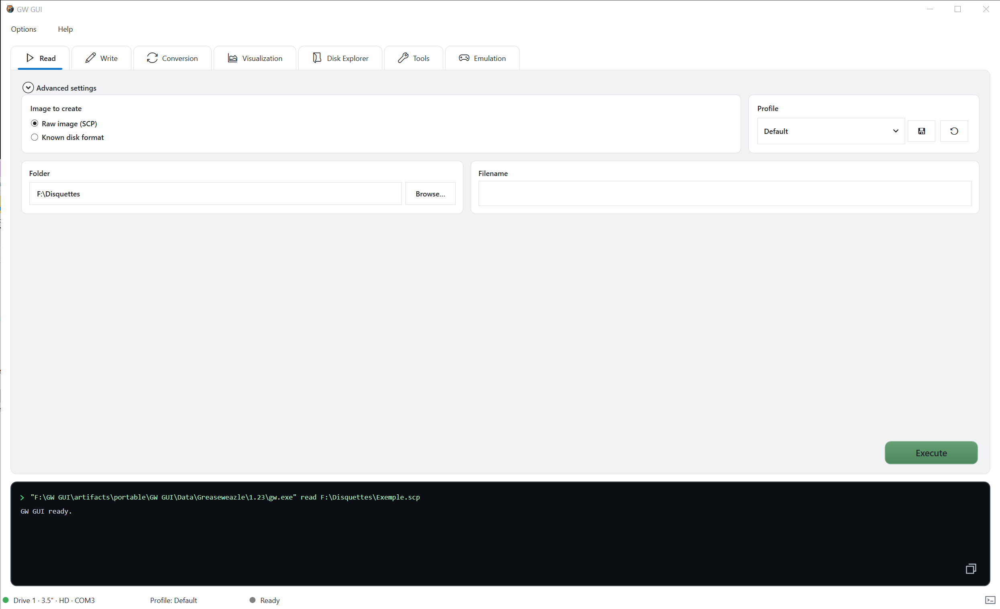

### Базова процедура

1. Вставте вихідний диск в налаштований диск.
2. Виберіть тип зображення:
   - **Сире зображення (03/16/2019)SCP)** зберігає інформацію про рівень флюсу.
   - **Відомий формат диска** створює зображення за допомогою вибраної машини та формату.
3. Виберіть папку призначення.
4. Введіть ім'я файлу виведення.
5. Оберіть профіль, якщо це необхідно.
6. Зареєструватися **Виконувати**.

Консоль показує точну команду і прогрес. Не знімайте диск або відключіть контролер до завершення роботи.

### Вибір типу виведення

Зареєструватися **Сире зображення (03/16/2019)SCP)** коли мета є архівним захопленням, аналізом, відновленням або пізніше перетворення. Сирі записи зображень timing інформації та декількох революцій, які корисні для незвичайних форматів, слабких секторів, схем захисту та пошкоджених носіїв.

Зареєструватися **Відомий формат диска** коли ви вже знаєте, що сім'я диска і потребуєте прямого зображення сектора. Цей вибір може бути меншим і простіше відкрити в іншому програмному забезпеченні, але він являє собою декодований результат, а не кожна деталь, що спостерігається приводом.

При невизначеності спочатку створюйте сире зображення. Ви можете перетворювати його пізніше без читання диска знову.

### Склад, ім'я файлу та профіль

Про нас **Склад ** є каталогом призначення. Про нас ** Назва файлу** слід визначити диск без перекриття тільки на фізичному етикетці. Корисна назва архіву містить назву, номер диска або сторони, а також умовну замітку при необхідності. Не додавати розширення формату, які конфлікти з вибраним форматом виведення.

Р **Профіль ** застосовує збережений набір параметрів читання. Виберіть один тільки, коли ви знаєте, що він містить. Про нас ** Зареєструватися** профіль підходить для нормальної першої спроби; спеціальний профіль відновлення може навмисно читати більше революцій або різного діапазону треків, а отже, приймати довше.

### Розширені налаштування

Розгорнути **Розширені налаштування** для форматів доступу або експертних параметрів. Залиште ці значення, якщо диск вимагає певного діапазону треків, кількість революцій або варіант контролера.

Загальні розширені значення включають:

| Налаштування | Мета | При зміні |
|---|---|---|
| Діапазон треків | Знімає циліндри і голови, щоб читати | Односторонні медіа, незвичайна геометрія або цільовий прохід відновлення |
| Революції | Контроль, скільки обертань зразків | Підвищити нестійкі або захищені доріжки; зменшити тільки для швидкості при необхідності |
| Експерти | Додаткові параметри двигуна | Тільки при наступному документі Greaseweazle Керівництво |

### Перевірити успішне читання

Не покладайте тільки на відсутність діалогу про помилку. Після завершення команди:

1. Підтвердіть, що вихідний файл існує і не порожній.
2. Читати фінальні консолі для невиконаних або відсутніх треків.
3. Відкрийте зображення **Візуалізація** щоб перевірити, що обидві сторони і очікуваний діапазон треків містять дані.
4. Відкрийте для себе **Disk Explorer** при підтримці файлової системи.
5. Зберігати журнал роботи з важливими архівними захопленнями.

Якщо багаторазові дані відрізняються, зберігайте кожну сиру захоплення замість перезапису першого. Відмінності можуть бути корисними під час відновлення.

## Написання диска

Відкрийте **Написати** вкладка для запису існуючого зображення на фізичний диск.

### Базова процедура

1. Вставте пункт призначення.
2. Виберіть зображення джерела з **Поза «Ложки»**.
3. Підтвердити виявлений формат.
4. Оберіть профіль, якщо це необхідно.
5. Зареєструватися **Виконувати**.

Написання замінних даних на диску призначення. Перевірити обраний диск і зображення перед початком.

> **Попередження:** Письмова деструктивна. Замінює магнітні дані на диску призначення. Використовуйте захищений вихідний архів та окремий диск призначення.

### Перед написанням

Перевірити чотири елементи перед натисканням **Виконувати**:

1. **Посилання:** вибраний шлях - це призначене джерело зображення.
2. **Диск:** диск в диску можна сміливо переписатися.
3. **Привід:** розмір і щільність підходять для призначення середовища.
4. **Формат:** автоматичне виявлення або вибраний формат вручну відповідає зображенням.

Якщо зображення джерела не було протестовано, відкрийте його **Візуалізація ** або ** Disk Explorer** перший. Успішне написання не може відремонтувати неповний вихідний образ.

### Перевірка та модифікація треків

Після вибраного зображення **Візуалізація треків ** відкриває свою доріжку. ** Модифікація** виводить підтримувані модифікації зображень перед написанням. Доступні дії залежать від обраного формату та двигуна.

### Перевірка письмового диска

Коли двигун підтримує перевірку, використовуйте його для важливих медіа. Інакше, читати записаний диск назад до нового зображення і порівняти його декодовані вміст або перевірити його в **Візуалізація**. Зберігати перевірку захопити окреме з оригінального зображення, щоб оригінальний ніколи не перезаписався.

Якщо запис не виходить на послідовні треки, перевірте стан диска, щільність, привід чистоти та налаштування диска. Якщо збої виникають випадково, перевірте USB стабільність і контрольний зв'язок.

## Перетворення образів дисків

Про нас **Переклад** Вкладка перетворює вихідне зображення в один або кілька форматів призначення.

### Базова процедура

1. Виберіть зображення джерела.
2. Необов'язково забезпечать вихідні імена.
3. Виберіть сімейство машин.
4. Виберіть один або більше вихідних форматів і розширень.
5. Увімкнути **Додати теги** якщо файлові назви повинні використовувати налаштований шаблон тегу.
6. Зареєструватися **Виконувати**.

Про нас **Вибрані ** Панель перераховує задані виходи. ** Переміщення файлів** забезпечує виділений робочий процес для міграції підтримуваних файлів, а не виконання стандартного перетворення зображень.

### Вибір форматів

Про нас **Машини ** список фільтрів форматів, що відображаються в ** Видання** панель. Назва формату описує логічний макет диска; розширення описує вихідний контейнер. Деякі формати можуть бути представлені більш ніж одним розширенням, а деякі контейнери не можуть зберігати кожну функцію джерела.

Виберіть тільки виходи, які ви насправді повинні. Кілька форматів корисно при створенні архіального майстра, емулятор-сумісної копії, а також копію для іншого інструменту аналізу в одній операції.

### Вихідні намивання та теги

**Вихідні імена ** дозволяє керувати базовими іменами, створеними для вибраних форматів. ** Додати теги ** застосовує шаблон файлу, налаштований в ** Варіанти > Головна**Теги можуть зашифрувати сім'ю, формат, розширення, дату або час. Перегляд прикладу в Опції перед перетворенням великої партії, щоб файли були названі послідовно.

### Перевірка результатів перетворення

Для кожного запиту:

1. Підтвердіть, що файл був створений.
2. Перевірити консолі для треків або секторів, які не можуть бути декодовані.
3. Відкрийте результат **Disk Explorer** якщо вона містить підтримуну файлову систему.
4. Порівняти очікувану дискову ємність і вміст з джерелом.

Конверсія може завершитися при звіті про втрату інформації, яка властива формату призначення. Збережіть оригінальне сире зображення навіть при правильній перетворенні зображення.

## Візуалізація образу диска

Про нас **Візуалізація** Вкладка відображає структуру та розподіл даних зображення.

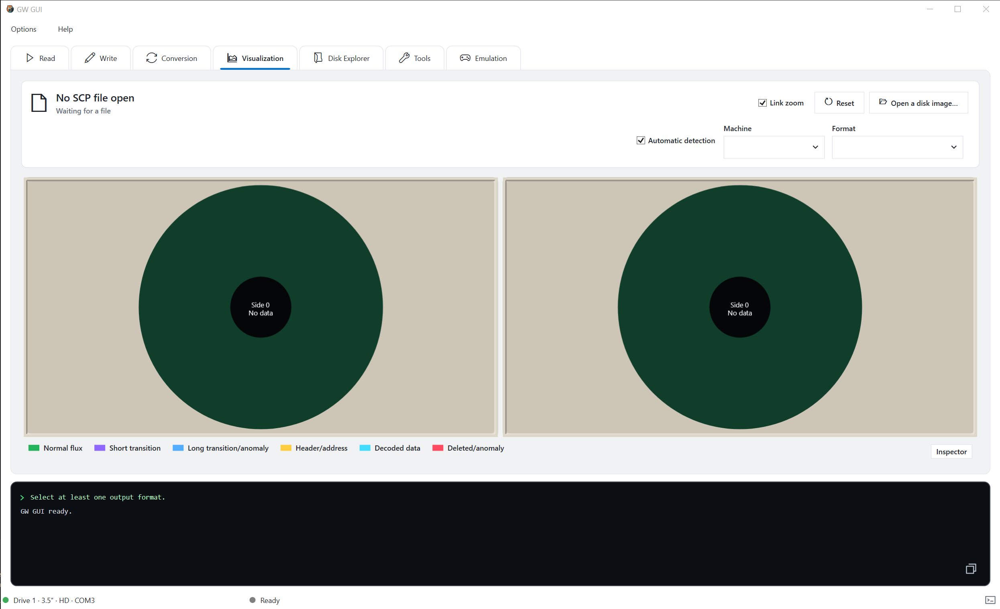

1. Зареєструватися **Відкрийте образ диска**.
2. Зареєструватися **Автоматичне виявлення** ввімкнути або вибрати машину і формат вручну.
3. Зареєструватися **Локомотив** зберегти обидві сторони на однаковому рівні масштабу.
4. Зареєструватися **Зареєструватися** відновлення початкового вигляду.
5. Відкрито **Інспектор** для детальної інформації про обрану область.

Легенда відрізняє нормальний потік, короткі та довгі переходи, заголовки, декодовані дані та виявлені аномалії. Сире зображення може містити дані, які не можуть бути вилучені в відомої файлової системи, але можуть бути перевірені тут.

### Перетворення вигляду

Кожна велика кругла панель являє собою одну дискову сторону. Центр ідентифікує стан даних, концентраційні позиції відповідають трекам. Кольори класифікують виявлені області за легендою. Для відповіді на питання:

- Чи містить зображення з одного боку або обох?
- Чи присутні очікувані треки?
- Чи виділяються аномалії або повторюються через диск?
- Виявлено автоматичне виявлення чуйної машини та формату?

Аномально-кольоровий колір є підставою для огляду регіону, не вистосувати, що диск не має можливості. Скопіювати захист, нестандартне форматування, слабкий запис і пошкоджений сектор може виробляти різні структури, які вимагають контекстного тлумачення.

### Рекомендована послідовність перевірки

Почати з пов'язаним зумом, щоб порівняти обидві сторони одночасно. Виберіть підозрюваний регіон, відкрити **Інспектор** і порівнювати його з сусідніми доріжками. Якщо результат виникає проблема виявлення, відключити автоматичне виявлення і вибрати відомий верстат і формат. Повернутися до автоматичного виявлення після тесту, так що примусове встановлення не випадково використовується для іншого зображення.

## Розширення вмісту дисків

Про нас **Disk Explorer** Підтримувані образи дисків як ієрархія файлу.

1. Відкрийте наявний образ або прочитайте диск.
2. Зареєструватися **Автоматичне виявлення** увімкнено, якщо ви повинні змусити машину або формат.
3. Перегляд інформації про об'єм: система, захист, файлова система, ємність, вільний простір та кількість елементів.
4. Перегляд каталогів у лівій панелі.
5. Виберіть елемент для перегляду його деталей в правій панелі.

Якщо формат зображення або файлова система не підтримується, використовуйте **Візуалізація** оглянути сиру структуру.

### Розуміння панелей

Верхній підсумок описує встановлене зображення і виявлений обсяг. Нижня ліва панель містить каталог ієрархію. Центральний список таблиць у вибраному каталозі з назвою, дата модифікації, тип і розмір. Правова панель показує деталі для вибраного елемента.

Disk Explorer не означає, що кожен сирий трек був декодований ідеально. Використовуйте об'ємний підсумок і кількість елементів, як швидкий перевірка працездатності, потім відкриті представницькі файли або порівняти їх з відомими каталогами, що містяться при збереженні точності.

### Коли нічого не з'являється

Спочатку підтвердіть, що шлях зображення правильний. Потім перевірте виявлений апарат і формат. Важкий образ може містити непідтримувані або пошкоджені файлові системи, в яких випадках дослідник може залишатися порожнім, хоча б якщо **Візуалізація** показує записані дані. Не перезаписувати або відкинути зображення джерела на основі тільки на порожній дослідник.

## Використання інструментів

Про нас **Інструменти** групи вкладок Greaseweazle обслуговування операцій.

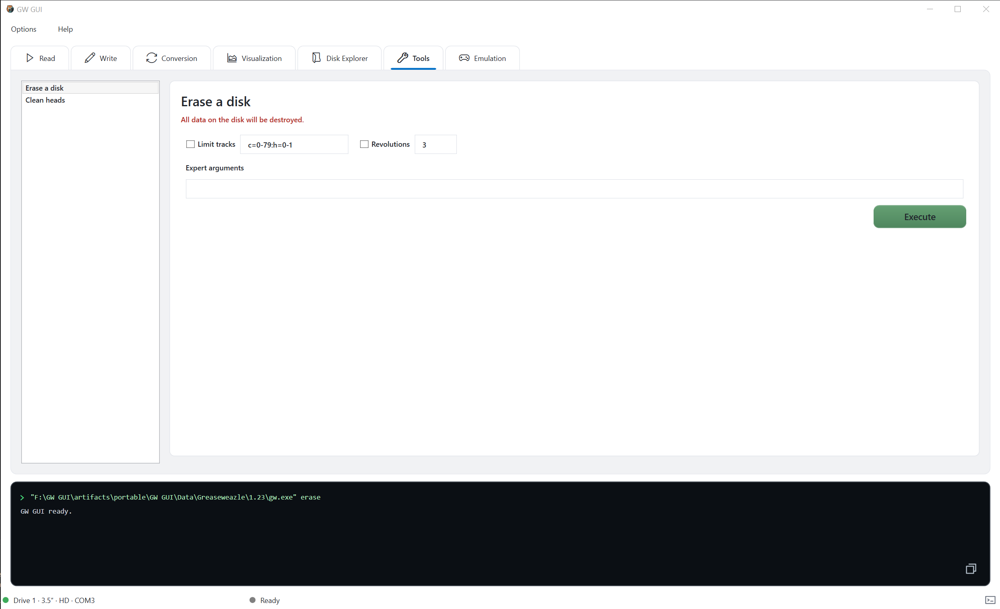

Виберіть команду з списку зліва, перегляньте його параметри, потім натисніть **Виконувати**. Побудовані або апаратно-змінні команди повинні використовуватися тільки після перевірки вибраного контролера і диска.

Більшість діалогів інструментів містять три області: параметри у верхній частині, статус і сировинна зона в центрі, і створену команду внизу. Увімкнути зміни командного попереднього перегляду як опції. параметр unchecked зазвичай означає «не змінюючи значення цього значення», тоді як перевірений параметр включає в себе значення в командному режимі.

Індивідуальні діагностичні діалоги описані в [Діагностика та обслуговування обладнання](#hardware-diagnostics-and-maintenance).

## Емуляція

### Відкриття збереженої машини

Про нас **Емуляція ** Списки вкладок зберігаються конфігурації. Виберіть один і натисніть ** Відкрито**. Кожна ходова машина з'являється у власному вкладці.

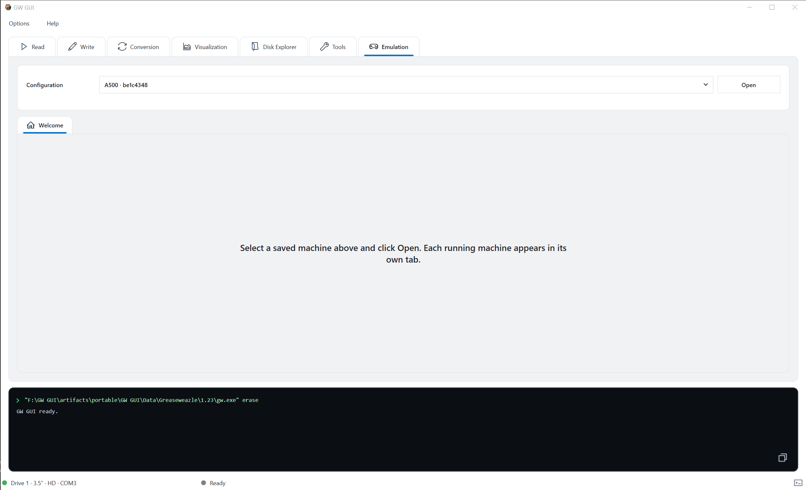

Створення та редагування машин в **Варіанти > Емульація > Налаштування ** і ** Варіанти > Емульація > Amiga**.

Якщо ви не з'являється конфігурація, створіть один в опції. Збережена конфігурація поєднує в собі модель машини, версія емулятора, ROM, пам'ять, відео, аудіо, зберігання та вхідні карти. Збереження конфігурації не запускає його; повернення в основний **Емуляція ** вкладка і натисніть ** Відкрито**.

### Контроль пускових машин

Запускний апаратний панель інструментів забезпечує потужність, пауза, скидання, економія, навантаження, захоплення та контроль відображення. Це також показує:

- налаштовані швидких і швидких навантажень;
- активний рендер, наприклад, Direct3D 11;
- повноекранні та миша-випускні ярлики;
- аудіо, контролер і стан мишки;
- поточна роздільна здатність, швидкість оновлення та частота кадрів.

Дискова смужка внизу емульсійного дисплея керує знімними носіями для кожного емульсійного диска. Завдання клавіатури можуть бути змінені в **Варіанти > Емульація > Шорти**, в той час як емульована клавіатура, миша та контролер картування налаштовані в відповідному Amiga вкладки.

### Посилання

| Контрольна група | Мета |
|---|---|
| Потужність і пауза | Стартує, зупиняється, паузи або відновлює ізольовану машину |
| Контроль за активами | Виконує налаштовану дію м'якого або жорсткого скидання |
| Контроль стану | Економія або завантаження емуляторного стану для швидкого продовження |
| Захоплення | Заощаджує зображення емульованого дисплея |
| Показати | Змінює презентацію дисплея або вводить повноекранний екран |
| Quick-state нагадування | Показує активні скорочення навантаження / завантаження |
| Рендер | Повідомляє активну відеопідтримку |
| Нагадування про введення | Показує повноекранні та миша-випускні ярлики |
| Індикатори пристрою | Повідомляє аудіо, контролер та стан мишки |
| Продуктивність | Звіти про вихідний розмір, частоту оновлень та частоту кадрів |

### Отримуючи повноекранний або знімаючи мишу

Панель інструментів відображає вказані ключі. У ілюстраційній конфігурації, **Мали+ Повернення ** Toggles повноекранний і ** Ф12** випускає мишу. Визначте отримані значення як авторитетні, оскільки ярлики можуть бути відкладені.

### Використання floppy медіа

Дискова смуга визначає кожен емульований диск, наприклад, `DF0:`. Використовуйте свої медіа-елементи для вставки, заміни або вводити зображення. Заміна медіа зміни тільки вставленого диска ходової машини; вона не змінює визначення накопичувача в збереженій машині, якщо ця дія явно збережена.

## Параметри програми

Відкрито **Варіанти** від головного вікна для налаштування програми.

### Головна

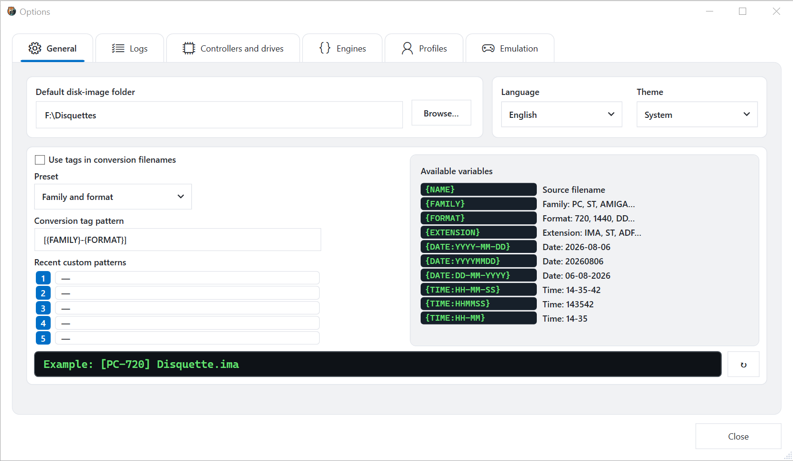

Про нас **Головна** Вкладка містить:

- папка за замовчуванням;
- мова інтерфейсу та тема;
- генерація файлу для перетворення;
- попередньо визначені та недавні користувацькі шаблони тегів;
- JavaScript licenses API Веб-сайт Go1.13.8

Включає в себе назву джерела, сім'ю, формат, розширення, дата і час. Використовуйте кнопку скидання для відновлення шаблону за замовчуванням.

Оновлення попереднього перегляду файлів до будь-яких файлів. Використовуйте його для виявлення дублікованих сепараторів, відсутніх розширень або неоднорідних імен. Останні користувальницькі візерунки забезпечують швидкий доступ до попередніх схем для назування без заміни поточного заміщення.

### Логін

Настроювання можна налаштувати самостійно для кожної операції. Для кожної категорії виберіть, чи зберігати журнали, встановити максимальний розмір файлу, і вирішіть, чи повинні зберігатися попередні журнали. Розмір `0` без обмежень. **Відкрити папку** відкриває поточний каталог журналу.

Увімкнути **Зареєструватися** для збереження та діагностичної роботи, де історія декількох завдань. Вимкніть його, коли буде корисний тільки останній результат. Максимальні ліміти розміру застосовуються для зберігання колод, не захоплених образів дисків.

### Контролери та диски

Використовуйте цю вкладку:

- сканування для підключених контролерів;
- додати і видалити налаштування дисків;
- вибрати розмір приводу, щільність та швидкість;
- збереження параметрів обладнання;
- вибрати або автоматично знайти `gw.exe`;
- перевірити і завантажити Greaseweazle Host Tools оновлення;
- відновити раніше налаштований виконуваний шлях.

Збережені налаштування обладнання залишаються доступні при відключенні диска.

#### Додавання диска

1. Зареєструватися **Сканування** і очікування підключених контролерів з'являтися.
2. Зареєструватися **Додати диск** якщо необхідний диск вже не зазначений.
3. Виберіть номер логічного приводу, фізичний розмір, щільність запису та швидкість обертання.
4. Збережіть ряд.
5. Підтвердіть, що він показує **В наявності ** і ** Конфігурація**.

Використовуйте контроль сміття тільки для видалення збереженої конфігурації; він не відключає апаратне забезпечення. Якщо з'являється однаковий контролер на інший COM перейменування порту, сканування знову до того, що збережений порт все ще діє.

#### Управління Greaseweazle Host Tools

**Пошук gw.exe ** пошуки відомих місць. ** Обрати ** вибирає конкретний виконуваний. ** Перевірити оновлення ** запити, доступні варіанти без заміни встановленого. ** Завантажити останню версію ** встановлює вибраний поточний пакет і ** Використовуйте попередній шлях ** відновлює раніше налаштоване розташування. Після зміни виконуваних, запустіть ** Інформація про контролер** підтвердити, що вибрана версія може спілкуватися з контролером.

### Двигуни

Виберіть двигун самостійно для читання, написання, перетворення і Disk Explorer. Вибраний двигун використовується строго: якщо він не може виконувати запитану операцію, GW GUI повідомляє про обмеження замість безшумних комутаторів.

Ця незалежність є навмисною. Наприклад, фізичні читання можуть використовуватися Greaseweazle Host Tools при перетворенні зображень і розвідці використовують внутрішній двигун. Вибір двигуна в профілі або проектної замітки при репродуктивності

### Профілі

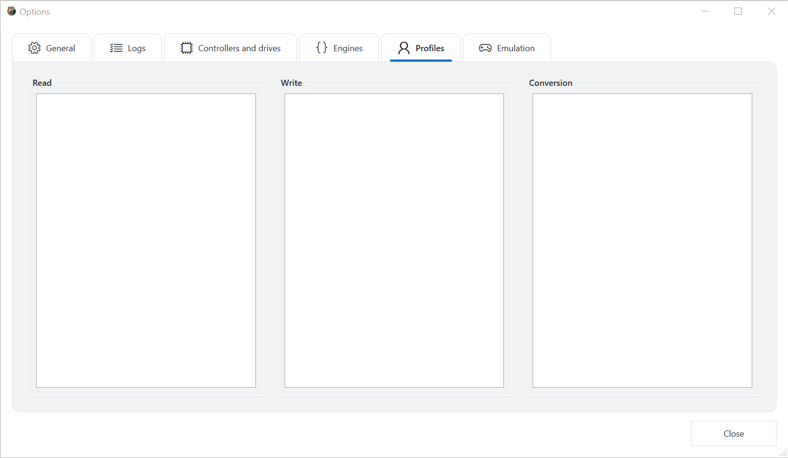

Профіль зберігає багаторазові налаштування для читання, запису та перетворення. Виберіть відповідну категорію для управління його профілів. Вибраний профіль відображається в головному рядку статусу і в екранах роботи.

Використовуйте профілі для повторюваних робочих процесів, а не як непередбачених колекцій експертних прапорів. Подаруйте кожному профілю назву, зокрема, диска, сімейства дисків або способу відновлення. Перегляд профілю після оновлення основного двигуна, оскільки параметри підтримки можуть змінитися.

## Параметри емульсії

Про нас **Емуляція** параметри містять загальні налаштування зберігання, глобальні ярлики, збережені конфігурації та налаштування машин.

### Загальні папки емульсії

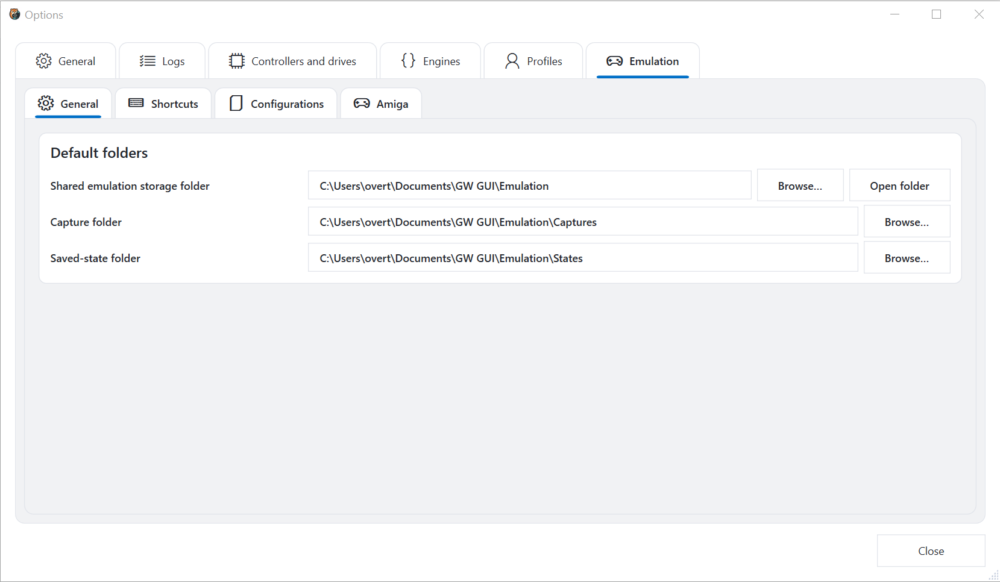

Встановіть папку спільного емуляційного сховища та папки за замовчуванням для захоплення та збережених станів. **Відкрити папку** відкриває спільне розташування в File Explorer.

Тримайте захоплення та збережені стани в окремих папках. Захоплення є звичайним зображенням; збережений стан містить емулятор-специфічний стан машини і може залежати від версії емулятора і конфігурації, що його створено. Налаштуйте конфігурацію та медіа з важливими збереженими державами.

### Глобальні шорти

Пошук дії або завдання ключа, призначити або видалити ярлики, відновити за замовчуванням та прозорі конфлікти. стовпець стану визначає дійсні та конфліктні завдання.

Щоб змінити ярлик, знайти дію, натисніть **Приват ** і натиснути потрібну комбінацію клавіш. Перевірити статус перед закриттям опцій. **Очистити конфлікти ** видалення суперечок про конфлікти; це не відновлює за замовчуванням картування. Зареєструватися ** Відновлення за замовчуванням** коли ви хочете замінити користувацькі завдання зі стандартним набором.

### Збережені конфігурації

Список сторінок збережених машин. Виберіть конфігурацію для редагування його в **Amiga** Увійти Ви можете оновити список або видалити вибрану конфігурацію.

Видалення конфігурації видаляє збережене визначення машини. Не слід використовувати як спосіб вводити медіа або закрити запущену машину. Перед видаленням замітайте будь-який ROM, hard-disk зображення і державні файли, пов'язані з конфігурацією.

## Amiga конфігурація

Поточний інтерфейс забезпечує детальний Amiga конфігурація сторінок. Така ж структура налаштувань може бути розширена для інших емульсійних систем без зміни основного робочого процесу.

### Головна

Виберіть Amiga модель, зберегти конфігурацію, встановити або замінити емуляторну версію, і визначити папки за замовчуванням для жорстких дисків та інших носіїв. **Пошук версій** запитує офіційне джерело емулятора.

Почати з моделлю, оскільки вона перенапружує пізніше сторінок. Зміна його можна змінити CPU, пам'ять, ROM, вибір чіпсету та зберігання. Після вибору версії емулятора, збереження конфігурації перед запуском його з основного вікна. Встановлення іншої версії емулятора замінює версію, яка використовується цією конфігурацією; вона не створює друге копіювання машини.

### CPU

Про нас CPU сторінка показує процесор, обраний машинною моделлю і забезпечує сумісну точність, FPUі вибір швидкості. Варіанти, які не застосовуються до обраної моделі, залишаються вимкненими.

- **CPU модель** визначає емульований процесор.
- **Точність** контроль за моделлю часу. Цикл-екактні режими вигідної сумісності з апаратами, але вимагають більшої кількості обробки вузлів.
- **FPU** забезпечує сумісний плаваючий пристрій.
- **CPU швидкість** вибирає оригінальні терміни або прискорений режим.

Для базової конфігурації тримайте модельний ряд CPU і початкова швидкість. Зміна прискорення тільки після завантаження машин правильно на його стандартних налаштуваннях.

### RAM

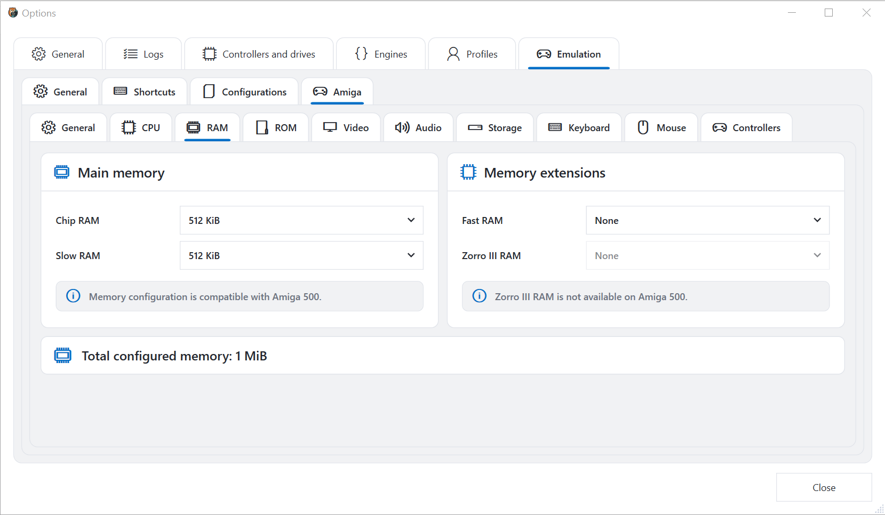

Налаштування чіпа RAM, Слив RAM, Швидкий RAMі підтримка розширення пам'яті. Повідомляємо про обмеження обраної машини, а загальна настрочена пам'ять відображається внизу.

**Чистка RAM ** Доступний для користувальницьких чіпсів і потрібна платформа. ** Слив RAM ** являє собою сумісну пам'ять розширення, що використовується загальними конфігураціями. ** Швидкий RAM ** - процесорно-орієнтована пам'ять розширення. ** Зорро III RAM** застосовується тільки до моделей, які підтримують архітектуру розширення. Повідомлення про сумісність і контроль вимкнено, що вибрана модель не може представляти.

### ROM

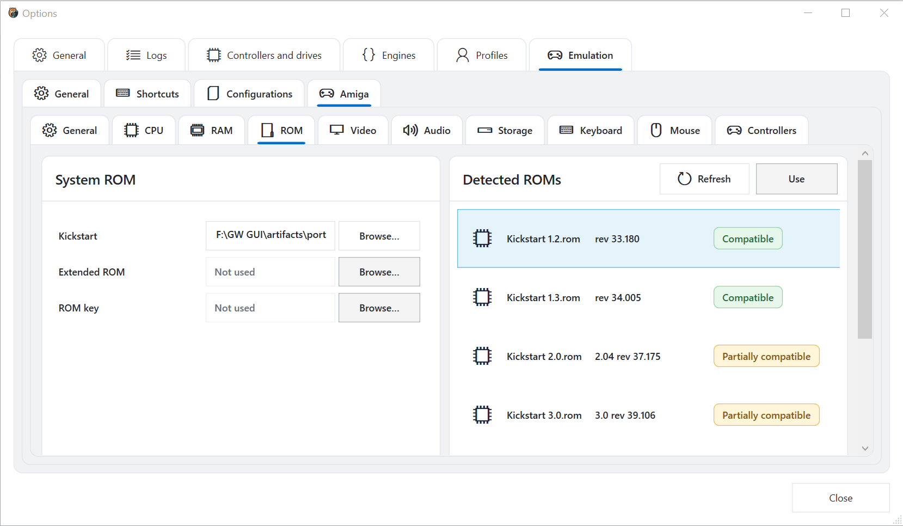

Виберіть систему Kickstart ROM, додаткові розширені ROMй ROM ключ. Виявлено-ROM Список відображає назви, версії та сумісність з вибраною моделлю. Виберіть виявлений ROM і натисніть **Зареєструватися**, або переглядати файл вручну.

ROM Файли не поставляються GW GUI. Використовуйте ROMs, які ви маєте право на використання.

Виявлений список бажаний, щоб здогадатися про ім'я файлу: він повідомляє про те, що ROM ідентифікація та оцінка сумісності з обраною моделлю. **Компания ** є нормальним вибором; ** Частково сумісний ** вказуємо, що ROM може завантажити, але не точно відповідає машині. ** Реверс ** rescans налаштований ROM розташування. ** Зареєструватися** призначає обраний виявлений ROM до конфігурації.

### Відео

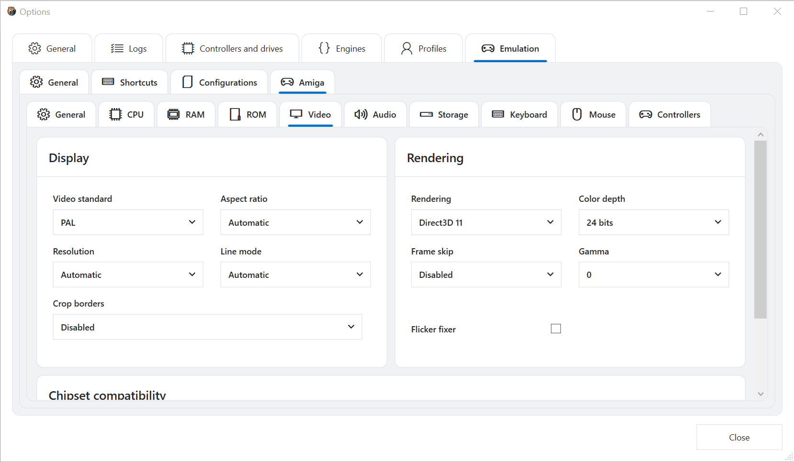

Налаштуйте відео стандарт, співвідношення сторін, роздільну здатність, режим лінії, обрізка кордону, рендеринг, глибину кольору, пропуск кадрів, гамма, і зафіксування флікерів. Додаткові параметри чіпсета доступні додатково внизу сторінки, коли підтримується вибраною моделлю.

| Налаштування | Практичний ефект |
|---|---|
| Відео стандарт | Вибрані PAL або NTSC час і очікувана поведінка |
| Співвідношення сторін | Контролює, як емульована картина масштабована |
| Рішення | Виберіть автоматичну або явну деталь |
| Режим роботи | Контролює лікування переплетених або подвійних відступів |
| Крапкові кордони | Видаліть невикористаний надшлунок тільки при включенні |
| Рендеринг | Підбір графіки |
| Ширина кольору | Виберіть вихідний колір точності |
| Рамка коропа | Зменшення рендерованих кадрів при включенні |
| Гамма | Регулює яскравість відгуку |
| Фіксатор Flicker | Режими обробки, які можуть бути інакше visibly flicker |

Зміна параметра одного відображення в часі. Якщо вікно емульсії стає порожнім або нестабільним, повертаємо в автоматичне рішення, відключається рама пропускаємо, нейтральна гамма і раніше працює рендеринг.

### Аудіо

Увімкнути або вимкнути аудіо, вибрати вихідний пристрій і затримки, після чого налаштовувати інтерполяції, Amiga фільтрування, тип фільтра, стереовідсічення, звук на диску та об'єм CD-audio.

Затримка низької затримки, але може викликати випадання на зайнятому комп'ютері. Підвищити його, якщо аудіо тріщини. Інтерполяція та Amiga аудіофільтр змін звукового відтворення, а не емулювати логіку програми. Приводний об'єм контролює імітаційний механічний звук окремо від нормального Amiga аудіо.

### Склад

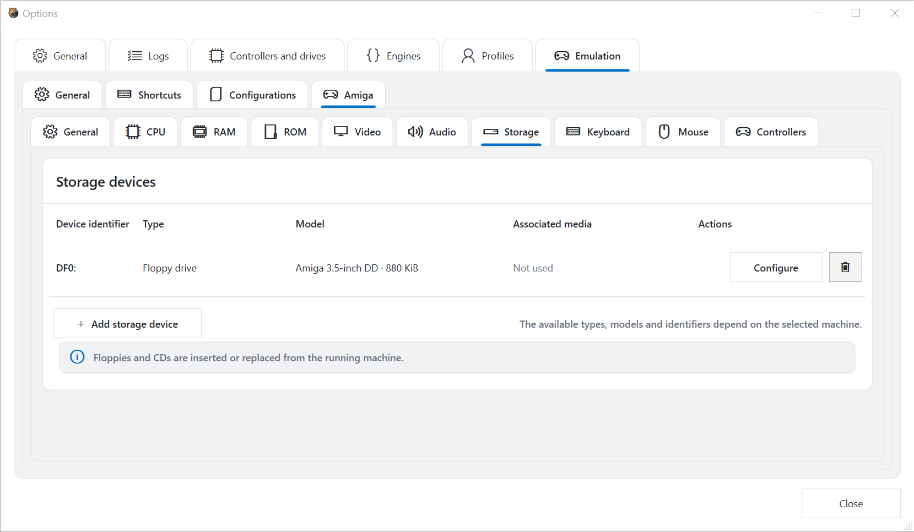

Списки сторінок зберігання пристроїв, типи, моделі, пов'язані медіа та доступні дії. Додавання, налаштування або видалення пристроїв тут. Недбалі диски і CD-диски можуть бути вставлені або замінені безпосередньо з ходової машини.

Про нас **ідентифікатор пристрою ** - як емульована система адресує пристрій. ** Тип ** відрізняє флопа, жорсткий диск, оптичні та інші підтримувані пристрої. ** Модель ** описує емульований апарат, в той час як ** Асоційовані медіа** ідентифікує в даний час призначене зображення. Налаштуйте пристрій перед тим, як з'ясувати цінні дані, і зберігайте резервні копії жорстких зображень.

### клавіатури

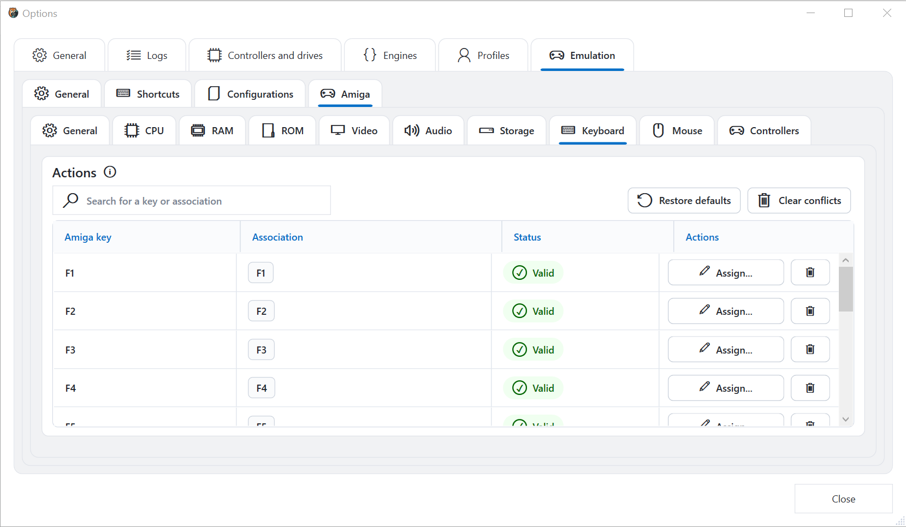

Пошук Amiga Ключові слова та завдання, призначають нові ключі, знімають картографування, відновлюють за замовчуванням або прозорі конфлікти. Повідомляємо про те, що кожне завдання діє.

Ліворучні імена стовпців Amiga ключ; **Асоціація** показує комбінацію ключа хосту. Важна карта може бути незручною, якщо Windows або додаток залишає таку ж ярлик, тому перевірити критичні комбінації всередині ходової машини. Уникайте присвоєння миші або повноекранної ярлики до ключа, що емульговане програмне забезпечення вимагає часто.

### Моуси

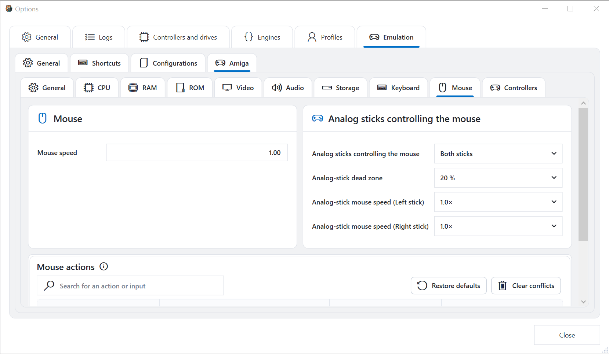

Налаштуйте фізичну швидкість мишки, оберіть яку аналогову палицю контролює мишу, відрегулюйте аналогову відмерлу зону і швидкість, а також налаштуйте миш-action mapping. Відновити типові або чіткі конфлікти з картуванням при необхідності.

Підвищити відмерлої зони, якщо контролер викликає тостерний дрейф. Налаштуйте швидкість лівої та правої палички самостійно при включенні обох паличок. Нижня таблиця картографування пов'язана з кнопками миші або діями; оглянути її статус конфліктів після зміни контролера, що малює в іншому місці.

### контролери

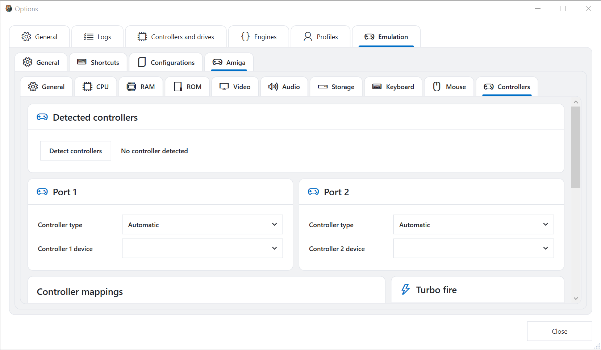

Виявлення підключених контролерів, призначених пристроїв та типів контролерів Amiga порти та налаштування параметрів контролера та турбо-вогонь. Доступні варіанти залежать від виявлених апаратних засобів і вибраної машини.

Порт 1 і Порт 2 налаштовані самостійно. **Автоматичний** Тип контролера - це чутлива початкова точка, але програмне забезпечення, що очікує конкретну джойстик або мишу, може знадобитися явний тип. Пробіг виявлення перед призначенням нового контролера. Турбо пожежа багаторазово активує картований вхід і повинен залишатися відключені, якщо гра або переваги програми від нього.

## Діагностика та обслуговування обладнання

Ці діалоги відкриті з **Інструменти ** Увійти Кожен діалоговий перегляд створеного Greaseweazle команда. Перегляньте його перед натисканням ** Виконувати**.

### Інформація про контролер

Відображення інформації, що повідомляється вибраним контролером. Розгорнути **Сирий вихід** коли вам потрібна повна відповідь команди.

Використовуйте це як перша діагностична команда. Успішне реагування підтверджує, що GW GUI може почати налаштовані інструменти хосту, що виконуються і спілкуватися з вибраним пристроєм. Записувати прошивку та апаратну інформацію перед виконанням оновлення.

### USB пропускна здатність

Заходи доступні USB пропускна здатність зв'язку. Використовуйте його, щоб діагностувати нестійкі передачі або невідповідність USB підключення.

Закрийте інші програми за допомогою контролера до тестування. Повторити вимірювання після зміни USB порт, кабель, або хаб. Порівняти результати за аналогічними умовами, а не обробляти єдиний вимір як абсолютна гарантія.

### Швидкість приводу

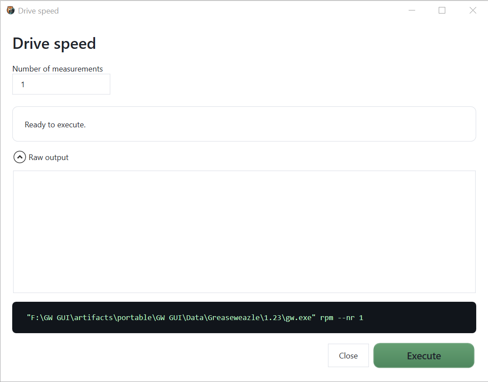

Заміряє швидкість обертання приводу. Підвищити кількість вимірювань при необхідності більш представницького результату.

Один вимірювання - це швидкий контроль; кілька вимірювань показує, чи стабільна швидкість. Додайте привід до нормальної швидкості до перекладу результату. Несподіване значення може вказувати неправильну настройову швидкість, механічні проблеми або задачу налаштування вимірювання.

### Дива голова

Перемістіть головку приводу до вибраного циліндра. **Дозволити екстремальні циліндри ** дозволяє нормально обмежувати позиції, і ** Зберігати активи двигуна** залишає рух, що працює при експлуатації. Використовуйте екстремальні позиції тільки тоді, коли апаратна процедура явно вимагає їх.

Нормальний пошук корисний для підтвердження руху голови або позиціонування перед діагностичною. Слухати аномальні багаторазові удари і зупинитися, якщо запитаний циліндр невідповідний для приводу. Цей інструмент не прочитає або перевіряє дані в циліндрі призначення.

### Діагностичне вирівнювання диска

Запускає повторне читання для аналізу дисків. Він підтримує вибір треків, революцію та кількість переглядів, формат декодування, сирий потік, індекс, швидкість, PLL, щільність-pin, жорсткий-сеектор, TG43Параметри зворотних даних. Підготовчі роботи вимагають відповідних довідкових засобів та технічних знань.

Починайте з відомим еталонним диском і найменшим набором накладів. **Альтернативні треки ** визначає доріжки та голови, які збираються; ** Революції на трек ** контроль тривалості кожного зразка; ** Кількість переглядів** визначає повторення. Увімкніть індивідуальне визначення диска або декодування формату тільки тоді, коли він відповідає посиланням. Параметри, такі як підроблений індекс, тверді сектори, PLL надрізи, щільні шпильки і TG43 є апаратно- або форматно-специфічною і може бути недійсним порівняння при використанні неправильно.

### Апаратні шпильки

Читання або зміни підтримуваного контролера шпильки. Виберіть шпильку, включити **Зміна шпильки ** тільки при написанні значення, і виберіть ** Високий рівень** при необхідності за призначенням апаратної операції.

З **Зміна шпильки** вимкнено, команда запитує шпильку. Це безпечніше за замовчуванням. Зміна рівня безпосередньо впливає на контролер I/O і слід виконувати тільки з правильним Greaseweazle апаратна документація та прикріплена проводка.

### Ресетний контролер

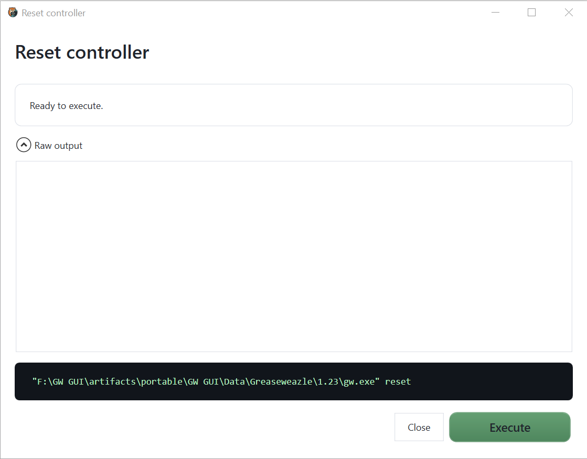

Смоктати Greaseweazle контролер. Використовуйте це, коли контролер виявлений, але більше не відповідає нормально.

Очікується, що будь-яка активна операція диска для завершення скидання. Після сканування контролера знову, якщо його статус підключення не відновлюється автоматично. Скинути не відремонтувати неправильно `gw.exe` шлях або відключений USB пристрій.

### Делей

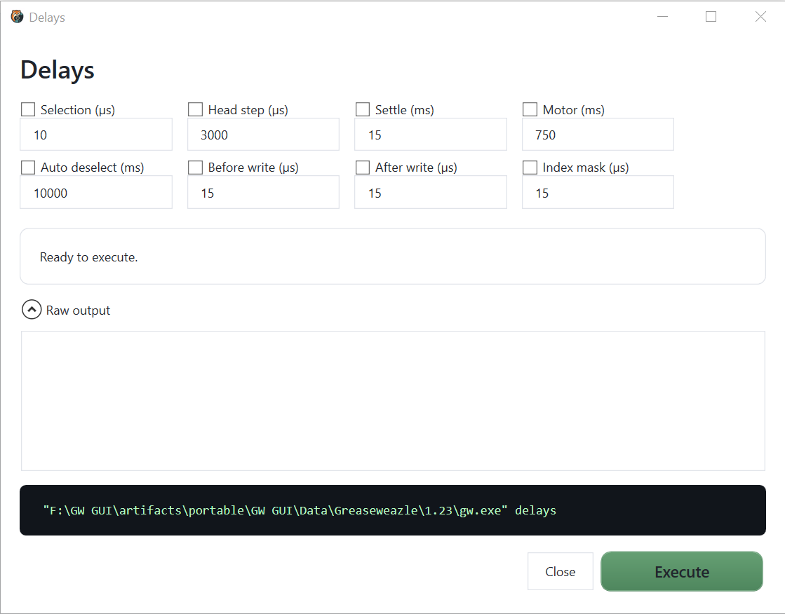

Читає або змінює значення контролера, в тому числі вибір, крок голови, посадка, двигун, автоматична деселекція, записання часу і індекс затримки маски. Увімкніть тільки значення, які ви хочете змінити.

Неперевершені поля залишають відповідне значення контролера. Перед редагуванням записуйте існуючі значення. Термінові зміни можуть впливати на кожну наступну фізичну операцію, тому тест з витривалими медіа та відновлення відомих значень, якщо поведінка стає ненадійною.

### Прошивка

Оновлення прошивки контролера. **Оновлення завантажувача** Якщо на офіційному етапі прошивки не потрібно залишатися на зв'язку. Не відключіть контролер під час оновлення.

Перед тим як оновити, підтвердити підключений контролер з **Інформація про контролер**, використовувати стабільний прямий USB з'єднання і закривати інші програмні засоби, які можуть отримати доступ до нього. Після завершення відключення або пересканування контролера і отримання його інформації знову для перевірки вказаної версії прошивки.

## Історія роботи

Відкрийте історію роботи для перевірки збережених колод за допомогою операції.

Виберіть журнал зліва для відображення його вмісту. **Експорт** зберігає копію для діагностики або підтримки. Шляхи і командні рядки можуть містити імена папок, тому огляд експортованих колод до їх спільного доступу.

У прямому ефірі консоль в головному вікні відображається поточна команда і останні вихідні. Його копіювання кнопки копіює текст відображення.

### Читання журналу

Корисний діагностичний журнал містить створену команду, своєчасність, вихід двигуна та кінцевий статус. Робота знизу вгору: виявляти остаточну помилку, потім знайти першу попередження або не відстежити, що передувало її. Через генеричну недостатність часто тільки наслідок раніше, більш конкретного повідомлення.

При порівнянні з двома спробами перевірте, що контролер, диск, двигун, профіль, початковий шлях, формат виходу та аргументи експерта ідентичні. В іншому випадку може відображатися зміни параметрів, а не нестабільність диска.

## Дані та переносне використання

GW GUI зберігає дані користувачів, відокремлені від додатків. Залежно від вибраного пакету та режиму, налаштувань, журналів, завантажених інструментів, компонентів емулятора, захоплення, станів та конфігурації машин зберігаються в додатку `Data` каталог або в налаштуваннях розташування даних користувачів.

Перед заміною або переміщенням портативної установки, зберігайте повну папку додатків разом і назад вгору `Data` папка. Не перемістіть окремі файли з `lib`, оскільки програма вирішує власні та сторонні бібліотеки з цієї структури.

### Збережені вміст резервних копій

Після того, як вони важливі для вашого робочого процесу:

- налаштування та профілі додатків;
- контролер та визначення дисків;
- конфігурація емульсії;
- ROM шляхи та юридично проводяться ROM резервні копії;
- hard-disk і знімні медіа зображення;
- захоплення та збережені держави;
- журнали роботи, що використовуються у вигляді записів збереження.

Дискові зображення можуть бути набагато більше, ніж налаштування. Зберігати архівні майстерні, які читаються, і працювати над копіями.

## Рекомендовані робочі процеси

### Архівування невідомого диска

1. Перевірка та очищення диска за допомогою відповідної процедури технічного обслуговування.
2. Захищайте диск, якщо це можливо.
3. Обрати **Читати > Сире зображення (03/16/2019)SCP)**.
4. Використовуйте дескриптивне ім'я файлу і прочитайте діапазон нормальної доріжки з декількома революціями.
5. Перегляд консолі та збереженого входу.
6. Перевірте обидві сторони в **Візуалізація**.
7. Конвертувати копію і, ймовірно, формати сектора.
8. Тестування перетворених копій в **Disk Explorer** або підходить програмне забезпечення.
9. Збережіть сирий майстер, ввійдіть і відзначає разом.

### Відновлення диска з зображення

1. Переглядайте зображення і підтвердіть очікувану сім'ю і формат.
2. Вставте витривалий або навмисно збитий диск правильного розміру і щільності.
3. Відкрито **Написати** і виберіть зображення.
4. Підтвердіть налаштований диск і виявлений формат.
5. Напишіть диск.
6. Перевірити його назад до окремого зображення перевірки.
7. Порівняти декодовані вміст і переглядати підозрі треки візуально.

### Створення емульсії Amiga

1. Відкрито **Варіанти > Емульація > Налаштування** і створити або вибрати машину.
2. У **Amiga > Загальні**, вибрати модель і емулятор варіант.
3. Призначте сумісну, юридично отриману ROM.
4. Тримайте типові за замовчуванням моделі CPU і RAM на першому завантаженні.
5. Налаштування відео та аудіо з консервативними автоматичними налаштуваннями.
6. Додавання пристроїв зберігання та асоційованих скопійованих медіа зображень.
7. Перегляд клавіатури, мишки та налаштування контролера.
8. Збережіть налаштування.
9. Повернення **Емуляція **, вибрати його і натисніть ** Відкрито**.
10. Тільки після успішного базового завантаження змініть прискорення або розширені налаштування одночасно.

## Контроль безпеки

До **Читати далі**:

- вихідного диска в правому диску;
- джерело захищено, де це можливо;
- вихідний шлях не буде перезаписати існуючий майстер;
- профіль і діапазон треків відповідають диску.

До **Написати ** або ** Панчохи**:

- диск призначення може бути знищений;
- правильність зображення і привід;
- розмір дисків і щільність сумісні;
- не використовується в якості призначення.

Перед апаратним інструментом:

- немає іншої операції;
- обраний правильний контролер;
- записано поточні значення;
- контролер має стабільну потужність і USB підключення;
- Діяльність підтримується апаратною документацією.

## Виправлення несправностей

### Контролер не входить

1. Від'єднати контролер безпосередньо на комп'ютер.
2. Відкрито **Варіанти > Контролери та диски**.
3. Зареєструватися **Сканування**.
4. Перевірити статус контролера та налаштування диска.
5. Пробіг **Інформація про контролер** якщо виявлення досягається, але команди не можуть.

Якщо це ще не з'являється, спробуйте інший прямий USB порт і кабель, потім rescan. Перевірте диспетчер пристроїв Windows для нещодавно виявлених серійних пристроїв. Контролер видимий для Windows, але відсутній GW GUI зазвичай вказує на зайнятий порт, конфігурацію застібки, або проблему інструментів Host Tools; контролер відсутній від точок Windows до USB, потужність, драйвер або обладнання.

### `gw.exe` не знайдено

Відкрито **Варіанти > Контролери та диски **, потім використовувати ** Пошук gw.exe **, ** Обрати **або ** Завантажити останню версію**. Підтвердити, що виявлені точки шляху до призначених Greaseweazle монтаж.

Після вибору його запустіть **Інформація про контролер**. Якщо це не вдається перед контактуванням апаратного забезпечення, перевірте журнал для нездійсненного шляху, відсутні файли або версія, яка не може початися.

### Операція використовує неправильний двигун

Відкрито **Варіанти > Двигуни** і перевірте двигун, призначений для точної роботи. GW GUI не мовчазно впаде до іншого двигуна.

Налаштування двигуна роздільні: зміна двигуна перетворення не змінює читання, написання або Disk Explorer. Відновити роботу після збереження опції і підтвердити створену команду в консолі.

### Зображення не визнається

Вимкніть автоматичне виявлення тільки якщо ви знаєте правильний верстат і формат. В іншому випадку спробуйте **Візуалізація** вкладка для перевірки зображення на нижній рівень.

Перевірте, чи є джерело сирого захоплення потоку, зображення сектора, стисненого контейнера, або не пов'язаний файл з розширенням вводу. Ніколи не перейменувати розширення для виявлення сил; перетворення повинна інтерпретувати структуру джерела правильно.

### Емульація не починається

Перевірити збережену конфігурацію, встановлену версію емулятора, вибрану ROM, шляхи зберігання і сумісність моделі. Огляд журналу додатків для повної інформації про помилки.

Тимчасово повернеться CPU, RAM, відео та зберігання до простої моделі-сумісної базової лінії. Якщо базова лінія починається, відновіть одну настройку на час. Збережений стан, створений з іншою версією емулятора або визначення машин може також не обійтися навіть при роботі з чистим завантаженням.

### Короткий або вхід не працює

Перевірити як глобальний **Емульація > Шорти** сторінка і машинна клавіатура, миша або сторінка контролера. Вирішити будь-яке завдання, яке зазначено в конфлікті.

Якщо миша захоплюється, використовуйте ярлик, що відображається в панелі інструментів, що працює. Якщо контролер був підключений після того, як опції були відкриті, виявляти контролер знову перед його призначенням.

### Команда не випадково

1. Прочитайте вихід в живу консоль.
2. Відкрито **Історія діяльності** для повного збереженого входу.
3. Підтвердіть вибраний контролер, диск, профіль, двигун і шляхи файлів.
4. Експортувати відповідний журнал, якщо він повинен бути призначений для діагностики.

### Аудіо тріщини або паузи

Підвищити емуляцію аудіо latency, закрити CPU-інтенсивні додатки, а також повернення відеорамки пропускання та прискорення їх попередніх значень. Перевірити, що вибрано призначений пристрій для Windows. Зміна одного параметра в часі, щоб ефективна корекція була ідентична.

### дисплей емульсії є порожнім або повільним

Повернути роздільну здатність та режим лінії **Автоматичний**, відключити кадри, що фіксують тимчасово, і намагайтеся раніше працювати рендерера. Підтвердіть налаштування ROM і вставлені завантажувальні засоби дійсні. Про нас FPS Індикатор дозволяє відрізняти задачу рендерингу від машини, яка просто не завантажується.

### Прочитати містить нестійкі доріжки

Повторити читання на новий файл, збільшити революції, де доречно і порівняти уражені доріжки. Очистити головки приводу за допомогою правильної процедури і перевірте диск для фізичного пошкодження. Не багаторазово читати в'язкість або пошкоджені ЗМІ, оскільки подальші переходи можуть погіршити її.

## Глосарій

| Терміни | Значення в GW GUI |
|---|---|
| Контролер | Про нас Greaseweazle Інтерфейс обладнання підключений USB |
| Приват | Фізичний привід, прикріплений до контролера |
| Двигуни | Впровадження вибрано для виконання операції |
| Флюс | Термінова інформація, що представляє магнітні переходи з диска |
| Сире зображення | Захоплення інформації про низький рівень диска, такі як SCP |
| Сектор зображення | У логічних секторах організовано декодоване представництво |
| Революція | Один повний обертальний зразок під час читання доріжки |
| Циліндр | Посада радіальної головки; один циліндр може містити доріжки з кожного боку |
| Головна | З боку диска, вибраного фізичним приводом |
| Профіль | багаторазовий набір налаштувань для роботи |
| ROM | Зображення прошивок, необхідний емульсійним апаратом |
| Ощадний стан | Знімок ходового емулятора |
| Рендер | Графічний бекенд використовується для відображення емульсійного виходу |

## Швидке посилання

| Якщо ви хочете... | Перейти до вмісту |
|---|---|
| Збереження фізичного диска | **Читати далі** |
| Поставте зображення на диск | **Написати** |
| Виготовити інший формат зображення | **Переклад** |
| Огляд треків або аномалії потоку | **Візуалізація** |
| Перегляд файлів всередині зображення | **Disk Explorer** |
| Перевірити комунікацію контролера | **Інструменти > Інформація про контролер** |
| Заміри обертання приводу | **Інструменти > Швидкість приводу** |
| Переглянути останнє повідомлення | **Історія діяльності** |
| Налаштування обладнання | **Варіанти > Контролери та диски** |
| Оберіть виконання | **Варіанти > Двигуни** |
| Створення або редагування емульованої машини | **Варіанти > Емуляція** |
| Почати збережену машину | **Емуляція** |
