[🌐 Languages / Langues](../Home.md)

# GW GUI Användarguide

GW GUI är en Windows-applikation för att läsa, skriva, konvertera, inspektera och emulera floppy-disk bilder. Det kan styra Greaseweazle hårdvara, arbeta med diskbildfiler genom sin interna motor och köra sparade emulerade maskinkonfigurationer.

Denna guide beskriver det engelska gränssnittet som visas i den aktuella versionen av programmet. Det är skrivet som källan till den utskrivbara användarhandboken: skärmdumpar illustrerar kontrollerna, medan den omgivande texten förklarar vad man ska välja, varför man väljer det och hur man verifierar resultatet.

> **Viktigt:** Att läsa en disk är icke-destruktivt. Skriva, radera, firmware uppdatering, och vissa hårdvaruverktyg kan ändra media eller hårdvara. Läs varningen bifogad till det relevanta förfarandet innan du klickar ** Utförlig**.

### Hur man använder denna guide

Om detta är första gången du använder GW GUI, komplett [Komma igång](#getting-started)följ sedan [Läsa en disk](#reading-a-disk)Om programmet redan är konfigurerat, gå direkt till kapitlet för den operation du vill utföra. Alternativkapitlen fungerar som en referens när ett förfarande ber dig att ändra en enhet, motor, profil eller emulerad maskininställning.

Interface namn visas i **djärv** Filenamer, vägar, kommandon och bokstavliga värden visas som `code`Anteckningar förklarar normalt beteende; varningar identifierar operationer som kan ändra en disk, styrenhet eller lagrad konfiguration.

## Innehåll

1. [Förstå arbetsflödet](#understanding-the-workflow)
2. [Komma igång](#getting-started)
3. [Huvudfönstret](#main-window)
4. [Läsa en disk](#reading-a-disk)
5. [Skriva en disk](#writing-a-disk)
6. [Konvertera diskbilder](#converting-disk-images)
7. [Visualisera en disk bild](#visualizing-a-disk-image)
8. [utforska diskinnehåll](#exploring-disk-contents)
9. [Använda verktygen](#using-the-tools)
10. [Emulering](#emulation)
11. [Ansökningsalternativ](#application-options)
12. [Emuleringsalternativ](#emulation-options)
13. [Amiga Konfiguration](#amiga-configuration)
14. [Hårdvara diagnostik och underhåll](#hardware-diagnostics-and-maintenance)
15. [Loggar och operationshistoria](#logs-and-operation-history)
16. [Applikationsdata och portabel användning](#application-data-and-portable-use)
17. [Rekommenderade arbetsflöden](#recommended-workflows)
18. [Säkerhet checklista](#safety-checklist)
19. [Felsökning](#troubleshooting)
20. [Glossary](#glossary)
21. [Snabb referens](#quick-reference)

## Förstå arbetsflödet

GW GUI separerar fysisk-disk verksamhet från bildfilverksamhet:

| Mål | Input | Output | Rekommenderad sida |
|---|---|---|---|
| Bevara en floppy disk | Fysisk disk | Bildfil | **Läs mer** |
| Återskapa en diskett | Bildfil | Fysisk disk | **Skriv** |
| Ändra bildformat | Bildfil | En eller flera bildfiler | **Konvertering** |
| Inspektera spår och anomalier | Bildfil | Visuell analys | **Visualisering** |
| Bläddra filer lagrade i en bild | Stödda bild/filsystem | Filer och kataloger | **Disk Explorer** |
| Diagnosera en enhet eller kontroller | Greaseweazle Hårdvara | Mätningar eller status | **Verktyg** |
| Kör en sparad virtuell maskin | Sparad maskinkonfiguration | Emuleringssession | **Emulering** |

För bevarande, först göra en rå fånga och hålla den oförändrad som en mästare. Skapa konverterade eller reparerade arbetskopior från den mästaren. Detta undviker att upprepa en fysisk läsning och bevarar information som ett sektorsbaserat format inte kan behålla.

## Komma igång

### Krav

- Windows med Microsoft .NET Skrivbord Runtime krävs av programmet.
- Ett Greaseweazle controller för floppy-disk operationer.
- En konfigurerad väg till `gw.exe` när du använder Greaseweazle Host Tools motor.
- Lagligt erhållen ROM filer när en emulerad maskin kräver dem.

Ansökan kontrollerar den nödvändiga .NET-löptiden vid start. Om det saknas, följ installationsprompten, starta om GW GUI.

### Innan du ansluter hårdvara

Kontrollera följande innan du kör en fysisk-disk operation:

1. Ansluta Greaseweazle styrenhet till en stabil USB hamn.
2. Anslut floppy-kabeln med rätt orientering.
3. Anslut drivkraftförsörjningen innan du sätter in värdefulla medier.
4. Bekräfta att enhetens storlek och densitet matchar disken.
5. Skrivskydda källdisken när det är möjligt.

GW GUI kan inte förhindra skador orsakade av felaktig kabel, olämplig kraft eller en mekaniskt osäker körning. Testa obekant hårdvara med en expendable disk först.

### Första lanseringen

1. Öppet Öppet Öppet `gwgui.exe`.
2. Öppet Öppet Öppet **Alternativ**.
3. Inom **Controllers och drives** skanna för styrenheten och konfigurera enheten.
4. Kontrollera eller välj vägen till `gw.exe`.
5. Inom **Motorer** Välj vilken motor som ska utföra varje operation.
6. Återgå till huvudfönstret och välj önskad operationsflik.

### Bekräfta att installationen är klar

En arbetsinställning bör visa styrenheten och köra i statusfältet, till exempel ett drivnummer, storlek, densitet och COM hamn. Inom **Alternativ > Controllers och drives ** Kontrollören bör markeras **tillgänglig ** och enheten ** Konfigurerad **Kör ** Kontrollinformation** innan du läser värdefulla medier om du vill verifiera kommunikationen utan att ändra en disk.

### Välja en motor

GW GUI kan avslöja mer än ett genomförande för vissa operationer. och **Greaseweazle Host Tools** motor åberopar den konfigurerade `gw.exe`Den inre GW GUI motorn hanterar stödda operationer inom applikationen. Motorval är explicit och oberoende för läsning, skrivning, omvandling och Disk ExplorerOm en operation inte stöds av den valda motorn, GW GUI rapporterar detta tillstånd istället för att ändra motorer automatiskt.

## Huvudfönstret

De viktigaste fönstergrupperna huvudverksamheten i sju flikar:

- **Läs mer** skapar en bild från en fysisk disk.
- **Skriv** Skriver en bild till en fysisk disk.
- **Konvertering** omvandlar ett diskbildsformat till ett eller flera utdataformat.
- **Visualisering** visar spår och flux eller avkodade data.
- **Disk Explorer** bläddrar stödda filsystem och diskinnehåll.
- **Verktyg** ger hårdvaruunderhåll och diagnostiska kommandon.
- **Emulering** hanterar och körs sparade emulerade maskiner.

Konsolen längst ner visar kommandot som utförs och dess utgång. Statusfältet rapporterar den valda enheten, profilen och nuvarande tillstånd.

### Läsa gränssnittet

De flesta operationssidor följer samma mönster:

1. **Källa eller destination** kontroller identifiera disken, bilden eller mappen.
2. **Formatkontroller** Välj automatisk detektering eller en explicit maskin och format.
3. **Profilkontroller** tillämpa återanvändbara inställningar.
4. **Avancerade inställningar** exponera parametrar som normalt är valfria.
5. **Utförlig** startar operationen.
6. och **Konsol** Visar det genererade kommandot, framsteg, varningar och fel.

och **Utförlig** knappen innebär inte att alla värden är säkra för den insatta disken. Granska alltid destinationen och vald enhet innan en skriv- eller underhållsoperation.

### Status bar och konsol

Den vänstra sidan av statusfältet identifierar den aktiva fysiska enheten. Centret visar den aktiva profilen när man väljs. Statsindikatorn rapporterar om ansökan är klar eller upptagen. Konsolen är inte bara diagnostisk: det är auktoritativt register över kommandot som skickas till den valda motorn. Använd kopieringskontrollen när du behöver bevara eller dela kommandot.

## Läsa en disk

Öppna öppna **Läs mer** Flik för att fånga en fysisk diskett som en bild.

### Grundläggande förfarande

1. Sätt in källdisken i den konfigurerade enheten.
2. Välj bildtyp:
   - **Rå bild (SCP)** bevarar information på fluxnivå.
   - **Känd diskformat** skapar en bild med en vald maskin och format.
3. Välj destination mappen.
4. Ange utdatafilnamnet.
5. Välj en profil om det behövs.
6. Klicka **Utförlig**.

Konsolen visar exakt kommando och framsteg. Ta inte bort disken eller koppla bort styrenheten tills operationen är klar.

### Välja utgångstyp

Användning **Rå bild (SCP)** när målet är arkivfångst, analys, återhämtning eller senare omvandling. En rå bild registrerar tidsinformation och flera revolutioner, vilket är användbart för ovanliga format, svaga sektorer, skyddssystem och skadade medier.

Användning **Känd diskformat** när du redan känner till diskfamiljen och behöver en direkt användbar sektorsbild. Detta val kan vara mindre och lättare att öppna i annan programvara, men det representerar det avkodade resultatet snarare än varje detalj som observeras av enheten.

När du är osäker, skapa den råa bilden först. Du kan konvertera den senare utan att läsa skivan igen.

### Mappar, filnamn och profil

och **Mamma ** är destinationskatalogen. och ** Filenam** bör identifiera disken utan att endast förlita sig på dess fysiska etikett. Ett användbart arkivnamn innehåller titeln, disknumret eller sidan och en villkorsnot när det är tillämpligt. Lägg inte till en formatförlängning som strider mot det valda utgångsformatet.

Ett **Profil ** tillämpa en sparad uppsättning läsparametrar. Välj bara en när du vet vad den innehåller. och ** Standard** profil är lämplig för ett normalt första försök; en specialiserad återhämtningsprofil kan medvetet läsa fler revolutioner eller ett annat spårområde och därför ta längre tid.

### Avancerade inställningar

Expandera **Avancerade inställningar** för att komma åt formatspecifika eller sakkunniga parametrar. Lämna dessa värden oförändrade såvida inte disken kräver ett visst spårområde, revolutionräkning eller styralternativ.

Vanliga avancerade värden inkluderar:

| Inställning | Syfte | När man ändrar den |
|---|---|---|
| Track range | Begränsar cylindrar och huvuden att läsa | Ensidig media, ovanlig geometri eller ett riktad återhämtningspass |
| Revolutioner | Kontrollerar hur många rotationer som provas | Öka för instabila eller skyddade spår; minska endast för hastighet när det är lämpligt |
| Expert argument | Passerar ytterligare motorparametrar | Endast när du följer dokumenterad Greaseweazle vägledning |

### Verifiera en framgångsrik läsning

Förlita dig inte bara på frånvaron av en feldialog. När kommandot slutförs:

1. Bekräfta att utdatafilen finns och är inte tom.
2. Läs de sista konsollinjerna för misslyckade eller saknade spår.
3. Öppna bilden i **Visualisering** för att kontrollera att båda sidor och det förväntade spårområdet innehåller data.
4. Öppna den i **Disk Explorer** när filsystemet stöds.
5. Håll driftsloggen med viktiga arkivfångster.

Om upprepade läsningar skiljer sig, bevara varje råfångst istället för att skriva över den första. Skillnader kan vara användbara under återhämtning.

## Skriva en disk

Öppna öppna **Skriv** fliken för att skriva en befintlig bild till en fysisk diskett.

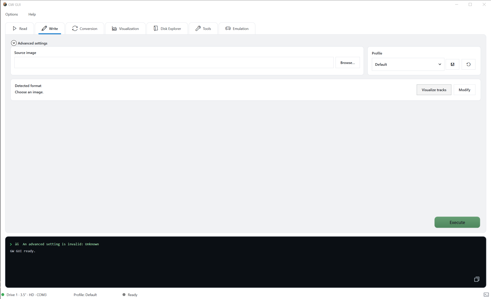

### Grundläggande förfarande

1. Sätt in destinationsdisken.
2. Välj källbilden med **Bläddra**.
3. Bekräfta detekterat format.
4. Välj en profil om det behövs.
5. Klicka **Utförlig**.

Skrivning ersätter data på destinationsdisken. Kontrollera den valda enheten och bilden innan du börjar.

> **Varning:** Att skriva är destruktivt. Den ersätter magnetiska data på destinationsdisken. Använd ett skrivskyddat källarkiv och en separat destinationsdisk när det är möjligt.

### Innan du skriver

Kontrollera fyra objekt innan du klickar **Utförlig**:

1. **Bild:** Den valda vägen är den avsedda källbilden.
2. **Disk:** disken i enheten kan säkert skrivas över.
3. **Kör:** den konfigurerade storleken och densiteten passar destinationsmediet.
4. **Format:** automatisk detektering eller det manuellt valda formatet matchar bilden.

Om källbilden inte har testats, öppna den i **Visualisering ** eller ** Disk Explorer** Först. En framgångsrik författare kan inte reparera en ofullständig källbild.

### Spåra inspektion och modifiering

När en bild väljs, **Visualisera spår ** öppnar sin spårrepresentation. ** Ändra** avslöjar de stödda bildändringarna innan du skriver. Tillgängliga åtgärder beror på det valda formatet och motorn.

### Verifiera en skriftlig disk

När motorn stöder verifiering, använd den för viktiga medier. Annars, läs den skrivna skivan tillbaka till en ny bild och jämföra dess avkodade innehåll eller inspektera den i **Visualisering** Håll kontrollen separeras från den ursprungliga bilden så att originalet aldrig skrivs över.

Om skriva misslyckas på konsekventa spår, kontrollera disktillstånd, densitet, driva renlighet och driva konfiguration. Om fel uppstår slumpmässigt, kontrollera USB stabilitet och controller kommunikation.

## Konvertera diskbilder

och **Konvertering** Fliken konverterar en källbild till ett eller flera destinationsformat.

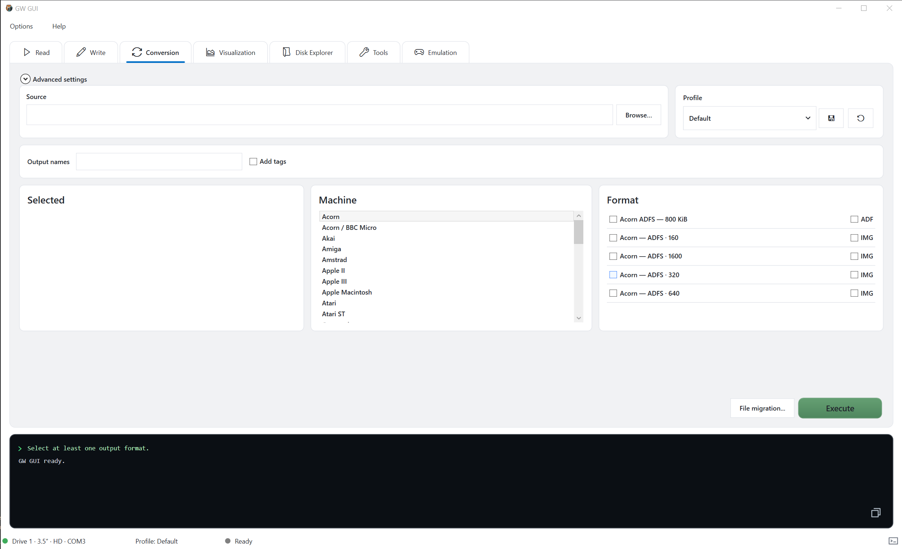

### Grundläggande förfarande

1. Välj källbilden.
2. Alternativt ge utdatanamn.
3. Välj en maskinfamilj.
4. Välj ett eller flera utdataformat och tillägg.
5. Aktivera **Lägg till taggar** om filnamn ska använda det konfigurerade tag-mönstret.
6. Klicka **Utförlig**.

och **Valt ** panelen listar de begärda utgångarna. ** Fil migration** ger det dedikerade arbetsflödet för migrerande stödda filer istället för att utföra en standard bildkonvertering.

### Välja format

och **Maskinmaskin ** Lista filter de format som visas i ** Format** panel. Ett formatnamn beskriver den logiska disklayouten; förlängningen beskriver utgångsbehållaren. Vissa format kan representeras av mer än en förlängning, och vissa behållare kan inte bevara alla funktioner i en rå källa.

Välj bara utgångar du faktiskt behöver. Flera format är användbara när du skapar en arkivmästare, en emulatorkompatibel kopia och en kopia för ett annat analysverktyg i en operation.

### Output naming och tags

**Utgångsnamn ** låter dig styra de basnamn som genereras för utvalda format. ** Lägg till taggar ** tillämpa filnamnsmönstret konfigurerat i ** Alternativ > General general**Taggar kan koda familj, format, förlängning, datum eller tid. Förhandsgranska exemplet i Alternativ innan du konverterar en stor sats så att filerna kallas konsekvent.

### Kontrollera konverteringsresultat

För varje begärd utgång:

1. Bekräfta att en fil skapades.
2. Konsolen för spår eller sektorer som inte kan avkodas.
3. Öppna resultatet **Disk Explorer** om det innehåller ett stöd filsystem.
4. Jämför förväntad diskkapacitet och innehåll med källan.

En omvandling kan slutföras när du rapporterar informationsförlust som är inneboende i destinationsformatet. Behåll den ursprungliga råbilden även när den konverterade bilden visas korrekt.

## Visualisera en disk bild

och **Visualisering** fliken visar strukturen och datadistributionen av en bild.

1. Klicka **Öppna en disk bild**.
2. Håll **Automatisk upptäckt** aktiverat, eller välj maskinen och formatet manuellt.
3. Användning **Länk zoom** att hålla båda sidor på samma zoomnivå.
4. Användning **Återställ** för att återställa den ursprungliga utsikten.
5. Öppet Öppet Öppet **Inspektör** för detaljerad information om den valda regionen.

Legenden skiljer normalt flöde, korta och långa övergångar, rubriker, avkodade data och upptäckta avvikelser. En rå bild kan innehålla data som inte kan avkodas i ett känt filsystem men kan fortfarande inspekteras här.

### Tolka utsikten

Varje stor cirkulär panel representerar en disk sida. Centret identifierar sidan och dess nuvarande datatillstånd; koncentriska positioner motsvarar spår. Färger klassificerar de upptäckta regionerna enligt legenden. Visualiseraren är avsedd att svara på frågor som:

- Innehåller bilden data på ena sidan eller båda?
- Är de förväntade spåren närvarande?
- Är avvikelser isolerade eller upprepade över disken?
- Har automatisk detektering identifierat en trovärdig maskin och format?

En anomali färg är en anledning att inspektera regionen, inte bevis på att disken är oanvändbar. Kopieringsskydd, icke-standardformatering, en svag inspelning och en skadad sektor kan producera olika strukturer som kräver kontextuell tolkning.

### Rekommenderad inspektionssekvens

Börja med länkad zoom som kan jämföras båda sidor i samma skala. Välj en misstänkt region, öppen **Inspektör** Jämför det med grannspår. Om resultatet verkar vara ett detekteringsproblem, inaktivera automatisk detektering och välj en känd maskin och format. Återgå till automatisk detektering efter testet så en påtvingad inställning används inte av misstag för en annan bild.

## utforska diskinnehåll

och **Disk Explorer** flik surfar stöds disk bilder som en fil hierarki.

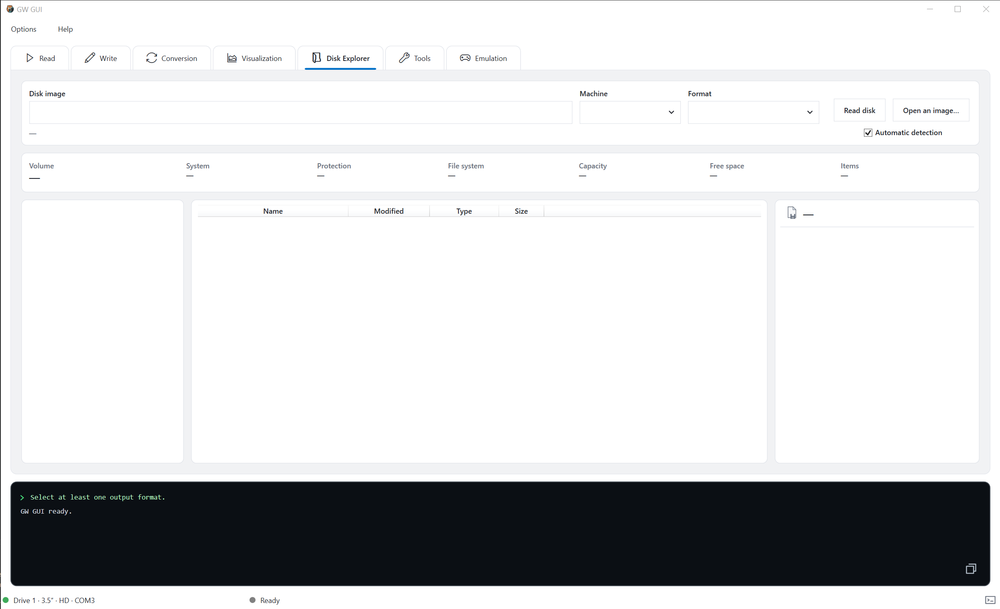

1. Öppna en befintlig bild eller läs en disk.
2. Håll **Automatisk upptäckt** aktiverad om du inte behöver tvinga en maskin eller ett format.
3. Granska volyminformationen: system, skydd, filsystem, kapacitet, ledigt utrymme och objekträkning.
4. Bläddra kataloger i vänsterpanelen.
5. Välj ett objekt för att visa dess detaljer i rätt panel.

Om bildformatet eller filsystemet inte stöds, använd **Visualisering** inspektera råstrukturen istället.

### Förstå panelerna

Den översta sammanfattningen beskriver den monterade bilden och detekterad volym. Den nedre vänstra panelen innehåller katalogen hierarki. Den centrala tabellen listar objekt i den valda katalogen med namn, ändringsdatum, typ och storlek. Den rätta panelen visar detaljer för det valda objektet.

Disk Explorer innebär inte att varje rå spår avkodades perfekt. Använd volymen sammanfattning och objekt räknas som en snabb rimlighetskontroll, sedan öppna representativa filer eller jämföra dem med en känd katalog notering när bevarande noggrannhet frågor.

### När ingenting visas

Bekräfta först att bildbanan är korrekt. Kontrollera sedan den upptäckta maskinen och formatet. En giltig bild kan innehålla ett osupporterat eller skadat filsystem, i vilket fall utforskaren kan förbli tom även om **Visualisering** visar inspelade data. Skriv inte över eller kassera källbilden baserat på en tom upptäcktsresande.

## Använda verktygen

och **Verktyg** Flikgrupper Greaseweazle underhållsverksamhet.

Välj ett kommando från listan till vänster, granska dess parametrar och klicka sedan på **Utförlig** Destruktiva eller hårdvaruförändrande kommandon bör endast användas efter att ha verifierat den valda styrenheten och enheten.

De flesta verktygsdialoger innehåller tre områden: parametrar på toppen, en status och raw-output-området i mitten och det genererade kommandot längst ner. Kommandoförhandsgranskningen ändras som alternativ är aktiverade. En okontrollerad parameter betyder normalt att "inte ändra detta värde", medan en kontrollerad parameter innehåller det värdet i kommandot.

De enskilda diagnostiska dialogerna beskrivs i [Hårdvara diagnostik och underhåll](#hardware-diagnostics-and-maintenance).

## Emulering

### Öppna en sparad maskin

och **Emulering ** fliklistor sparade konfigurationer. Välj ett och klicka ** Öppet Öppet Öppet**Varje körmaskin visas i sin egen flik.

Skapa och redigera maskiner i **Alternativ > Emulering > Konfigurationer ** och ** Alternativ > Emulation > Amiga**.

Om ingen konfiguration visas, skapa en i Alternativ först. En sparad konfiguration kombinerar maskinmodellen, emulatorversionen, ROM, minne, video, ljud, lagring och inmatningskartläggningar. Spara en konfiguration startar inte den; återgå till huvud **Emulering ** flik och klicka ** Öppet Öppet Öppet**.

### Running-maskin kontroller

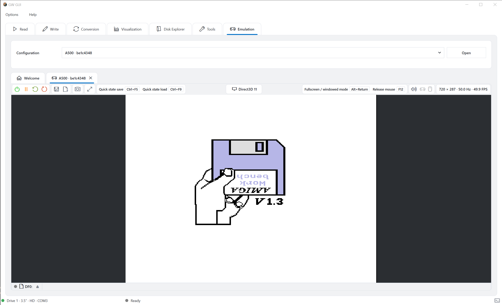

Den körmaskin verktygsfältet ger kraft, paus, återställning, spara-state, last-state, fånga och visa kontroller. Det visar också:

- de konfigurerade snabbspara och snabba genvägar;
- den aktiva givaren, såsom Direct3D 11;
- fullscreen och mus-release genvägar;
- ljud, controller och mustillstånd;
- den nuvarande resolutionen, uppdatera hastigheten och ramhastigheten.

Skivremsan längst ner i emuleringsdisplayen hanterar flyttbara media för varje emulerad enhet. Tangentbordsuppdrag kan ändras i **Alternativ > Emulering > genvägar**, medan emulerade tangentbord, mus och controller kartläggningar är konfigurerade i motsvarande Amiga Flikar.

### Toolbar referens

| Kontrollgrupp | Syfte |
|---|---|
| Kraft och paus | Startar, stannar, pausar eller återupptar den emulerade maskinen |
| Återställ kontroller | Utför konfigurerad mjuk eller hård återställningsåtgärd |
| Statliga kontroller | Spara eller laddar ett emulatortillstånd för snabb fortsättning |
| Capture | Spara en bild av den emulerade displayen |
| Display | Ändra presentationen eller ange fullscreen |
| Quick-state påminnelse | Visar de aktiva spara / ladda genvägarna |
| Renderer | Rapporterar den aktiva videobackend |
| Input påminnelse | Visar fullscreen och mus-release genvägar |
| Enhetsindikatorer | Rapporterar ljud, controller och mus tillstånd |
| Prestanda | Rapporter utgångsstorlek, uppdaterad frekvens och ramhastighet |

### Lämna fullscreen eller släppa musen

Verktygsfältet visar de för närvarande tilldelade nycklarna. I den illustrerade konfigurationen **Alt+ Återvänd ** Växlar fullscreen och ** F12** släpper musen. Behandla de visade värdena som auktoritativa eftersom genvägar kan omdefinieras.

### Använda floppy media

Drivremsan identifierar varje emulerad enhet, till exempel `DF0:`Använd sina mediekontroller för att infoga, ersätta eller skjuta en bild. Byte av media ändrar bara den insatta disken i körmaskinen; den ändrar inte lagringsenhetsdefinitionen i den sparade maskinen om inte den åtgärden uttryckligen sparas.

## Ansökningsalternativ

Öppet Öppet Öppet **Alternativ** från huvudfönstret för att konfigurera programmet.

### General general

och **General general** Fliken innehåller:

- standarddisk-image mappen;
- gränssnittsspråk och tema;
- filnamnsgenerering för omvandlingar;
- fördefinierade och senaste anpassade tag mönster;
- ett levande filnamn exempel.

Tag variabler inkluderar källnamn, familj, format, förlängning, datum och tid. Använd återställningsknappen för att återställa standardmönstret.

Filnamn förhandsgranskning uppdateringar innan några filer skapas. Använd den för att upptäcka duplicerade separatorer, saknade tillägg eller tvetydiga namn. Nya anpassade mönster ger snabb tillgång till tidigare namngivningssystem utan att ersätta den nuvarande förinställningen.

### Loggar

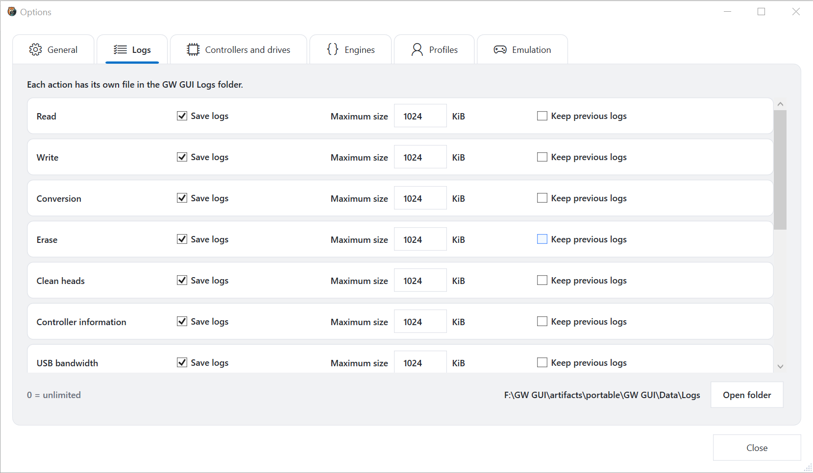

Logging kan konfigureras oberoende för varje operation. För varje kategori väljer du om du vill spara loggar, ange en maximal filstorlek och avgöra om tidigare loggar ska behållas. En storlek på `0` betyder obegränsad. **Öppen mapp** öppnar den aktuella log-katalogen.

Aktivera **Håll tidigare loggar** för bevarande och diagnostik där flera försöks historia spelar roll. Inaktivera det när endast det senaste resultatet är användbart. Maximala storleksgränser gäller för logglagring, inte för att fånga diskbilder.

### Controllers och drives

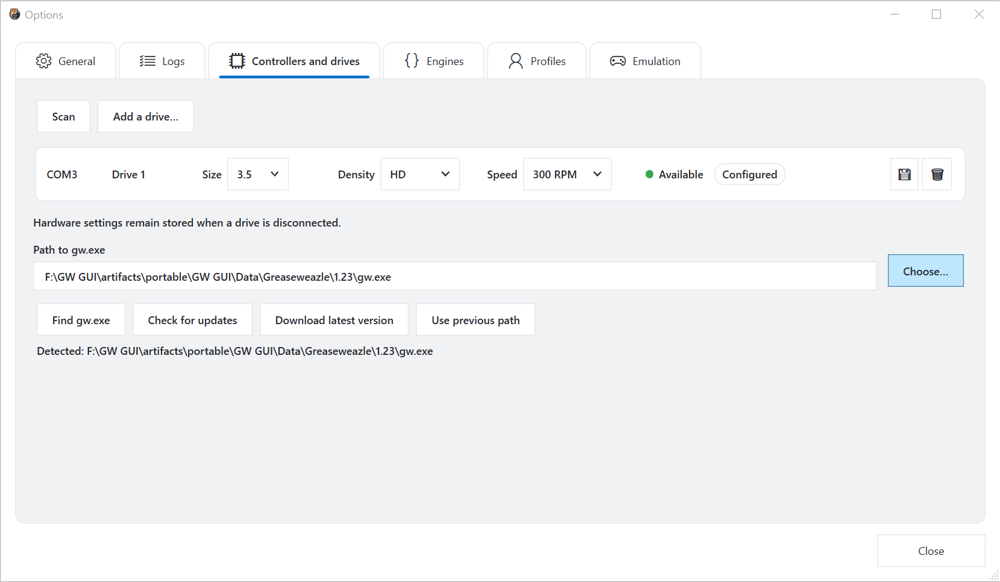

Använd denna flik till:

- skanna för anslutna kontrollanter;
- lägga till och ta bort enhetskonfigurationer;
- välja drivstorlek, densitet och hastighet;
- spara hårdvaruinställningar;
- välja eller automatiskt hitta `gw.exe`;
- Kontrollera och ladda ner Greaseweazle Host Tools uppdateringar;
- återställa en tidigare konfigurerad körbar väg.

Sparade hårdvaruinställningar är tillgängliga när en enhet tillfälligt kopplas bort.

#### Lägga till en enhet

1. Klicka **Scan** Och vänta på att anslutna styrenheter ska visas.
2. Klicka **Lägg till en enhet** Om önskad enhet inte redan är listad.
3. Välj dess logiska enhetsnummer, fysisk storlek, inspelningstäthet och rotationshastighet.
4. Spara raden.
5. Bekräfta att det visar **tillgänglig ** och ** Konfigurerad**.

Använd skräpkontrollen endast för att ta bort den sparade konfigurationen; den kopplar inte bort hårdvaran. Om samma kontroller visas på en annan COM Därefter skannar du igen innan du antar att den lagrade hamnen fortfarande är giltig.

#### Hantera Greaseweazle Host Tools

**Hitta gw.exe ** Söker kända platser. ** Välj Välj Välj Välj ** Väljer en specifik körbar. ** Kontrollera uppdateringar ** Förfrågningar tillgängliga versioner utan att ersätta den installerade. ** Ladda ner senaste versionen ** installerar det valda strömpaketet, och ** Använd tidigare väg ** återställer den tidigare konfigurerade platsen. Efter att ha ändrat körbar, kör ** Kontrollinformation** för att bekräfta att den valda versionen kan kommunicera med styrenheten.

### Motorer

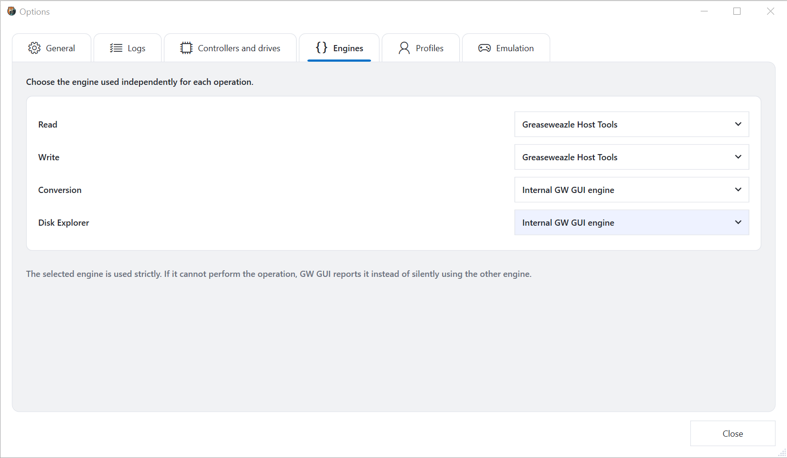

Välj motorn självständigt för att läsa, skriva, konvertera och Disk ExplorerDen valda motorn används strikt: om den inte kan utföra den begärda driften, GW GUI rapporterar begränsningen istället för att tyst byta motorer.

Detta oberoende är avsiktligt. Till exempel kan fysiska läsningar använda Greaseweazle Host Tools medan bildkonvertering och prospektering använder den interna motorn. Spela in motorval i en profil eller projektnot när reproducerbarhet är viktigt.

### Profiler

Profiler lagrar återanvändbara inställningar för läs-, skriv- och konverteringsverksamhet. Välj den relevanta kategorin för att hantera sina profiler. En vald profil visas i huvudfönsterstatusfältet och i driftsskärmar.

Använd profiler för repeterbara arbetsflöden snarare än som oförklarliga samlingar av expertflaggor. Ge varje profil ett ändamålsspecifikt namn, till exempel en viss enhet, diskfamilj eller återställningsmetod. Granska en profil efter uppdatering av den underliggande motorn eftersom stödda alternativ kan ändras.

## Emuleringsalternativ

och **Emulering** alternativ innehåller allmänna lagringsinställningar, globala genvägar, sparade konfigurationer och maskinspecifika inställningar.

### Allmän emulering mappar

Ställ in den delade emuleringslagringsmappen och standardmapparna för fångar och sparade stater. **Öppen mapp** öppnar den delade platsen i File Explorer.

Håll fångar och sparade stater i separata mappar. En fångst är en vanlig bild; ett sparat tillstånd innehåller emulatorspecifikt maskintillstånd och kan bero på emulatorversionen och konfigurationen som skapade den. Tillbaka upp konfiguration och media tillsammans med viktiga sparade stater.

### Globala genvägar

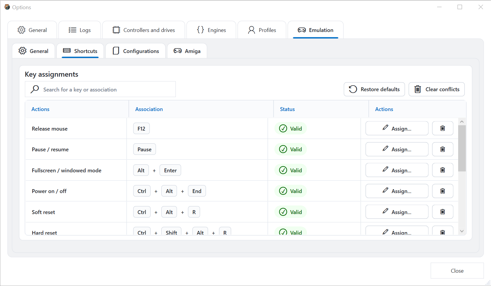

Sök efter en åtgärd eller nyckeluppdrag, tilldela eller ta bort genvägar, återställa standarder och tydliga konflikter. Statuskolumnen identifierar giltiga och motstridiga uppdrag.

För att ändra en genväg, hitta åtgärden, klicka **Tilldelning ** och tryck på önskad nyckelkombination. Kontrollera statusen innan du stänger alternativ. **Tydliga konflikter ** avlägsnar motstridiga uppdrag; den återställer inte standardkartläggningen. Användning ** Återställ standarder** när du vill ersätta anpassade uppdrag med standarduppsättningen.

### Sparade konfigurationer

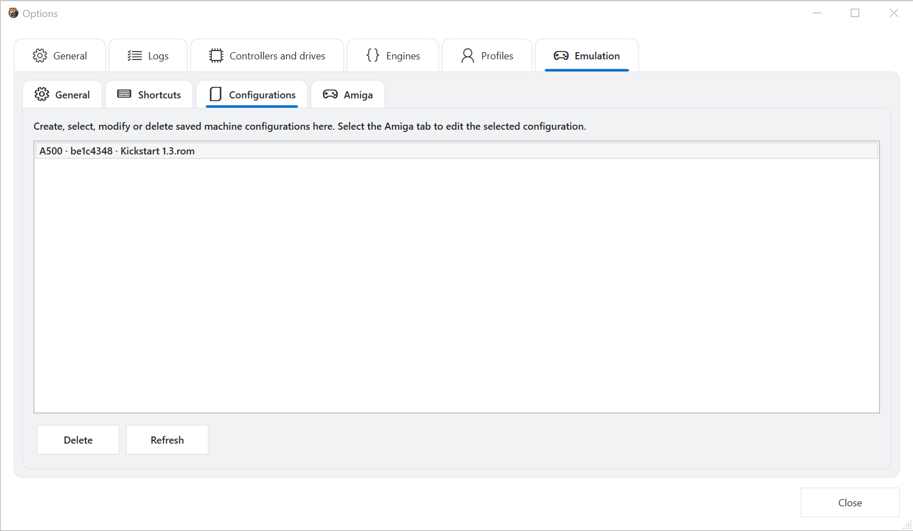

Denna sida listar sparade maskiner. Välj en konfiguration för att redigera den i **Amiga** Tab. Du kan uppdatera listan eller ta bort den valda konfigurationen.

Ta bort en konfiguration tar bort den sparade maskindefinitionen. Det bör inte användas som ett sätt att förmedla media eller stänga en körmaskin. Innan borttagning, notera någon ROM, hårddiskbild och statliga filer i samband med konfigurationen.

## Amiga Konfiguration

Det nuvarande gränssnittet ger detaljerad Amiga konfigurationssidor. Samma inställningsstruktur kan förlängas för andra emulerade system utan att ändra huvudflödet.

### General general

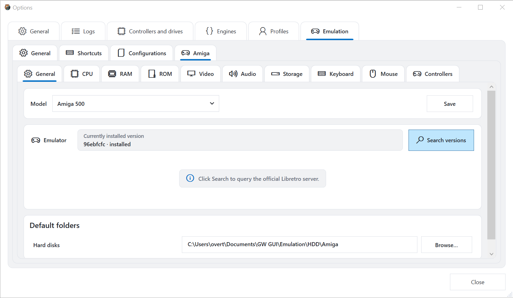

Välj det Amiga modell, spara konfigurationen, installera eller ersätta emulatorversionen och definiera standardmappar för hårddiskar och andra medier. **Söka versioner** Fråga den officiella emulator-version källan.

Börja med modellen eftersom den begränsar senare sidor. Ändra den kan ändra tillgängligheten CPUminne, ROMchipset och lagringsval. Efter att ha valt en emulatorversion, spara konfigurationen innan du startar den från huvudfönstret. Installera en annan emulatorversion ersätter den version som används av den konfigurationen; den skapar inte en andra kopia av maskinen.

### CPU

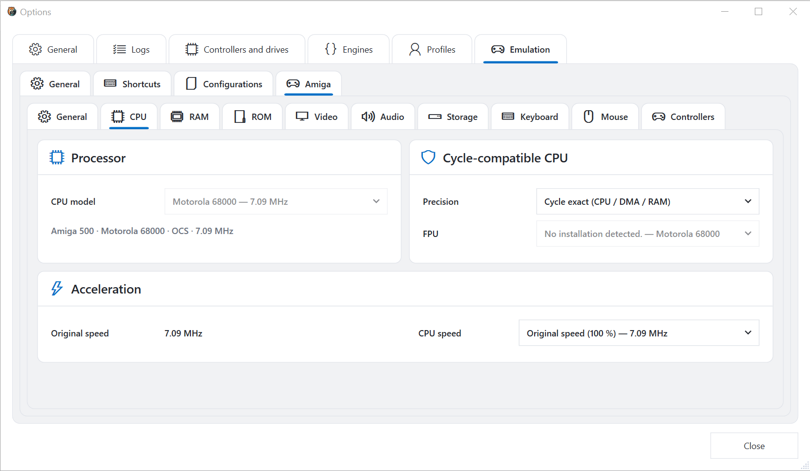

och CPU sidan visar processorn som valts av maskinmodellen och ger kompatibel precision, FPU, och hastighet val. Alternativ som inte gäller för den valda modellen är fortfarande funktionshindrade.

- **CPU modell** identifierar den emulerade processorn.
- **Precision** styr timing-modellen. Cykel exakta lägen gynnar hårdvarukompatibilitet men kräver mer värdbearbetning.
- **FPU** möjliggör en kompatibel flytpunkt enhet när den stöds.
- **CPU hastighet** Väljer originaltid eller ett accelererat läge.

För en baslinjekonfiguration, håll modellen härledd CPU och originalhastighet. Ändra acceleration först efter att maskinen stövlar korrekt vid sina standardinställningar.

### RAM

Konfigurera Chip RAMLångsam RAMSnabbt RAMoch stödde expansionsminnet. Kompatibilitetsmeddelanden förklarar begränsningar för den valda maskinen, och det totala konfigurerade minnet visas längst ner.

**Chip RAM ** är tillgänglig för anpassade chips och krävs av plattformen. ** Långsamt RAM ** representerar kompatibelt expansionsminne som används av gemensamma konfigurationer. ** Snabbt RAM ** är processorororienterat expansionsminne. ** Zorro III RAM** gäller endast modeller som stöder expansionsarkitekturen. Kompatibilitetsmeddelanden och funktionshindrade kontroller förhindrar kombinationer som den valda modellen inte kan representera.

### ROM

Välj systemet Kickstart ROM, valfri förlängd ROMoch ROM Nyckeln. Detekteras-ROM list visar namn, revideringar och kompatibilitet med den valda modellen. Välj en upptäckt ROM och klicka **Användning** eller bläddra till en fil manuellt.

ROM filer levereras inte av GW GUIAnvänd ROMs du är lagligt tillåten att använda.

Den upptäckta listan är att föredra att gissa från ett filnamn: den rapporterar ROM identitet och revidering och utvärderar kompatibilitet med den valda modellen. **Kompatibel ** är det normala valet; ** Delvis kompatibel ** indikerar att ROM kan starta men inte exakt matcha maskinen. ** Refresh ** rescans den konfigurerade ROM platser. ** Användning** Tilldelar den valda upptäckten ROM till konfigurationen.

### Video

Konfigurera videostandard, aspektförhållande, upplösning, linjeläge, gränsbeskärning, renderer, färgdjup, ram hoppning, gamma och flicker fixering. Ytterligare chipset inställningar är tillgängliga längre ner på sidan när stöds av den valda modellen.

| Inställning | Praktisk effekt |
|---|---|
| Videostandard | Väljer PAL eller NTSC timing och förväntat uppfriskande beteende |
| Aspect förhållande | Kontrollerar hur den emulerade bilden skalas |
| Beslut | Väljer automatisk eller explicit utgångsdetalj |
| Line mode | Kontroller behandling av interlaced eller line-doubled output |
| Gröda gränser | Ta bort oanvänd overscan endast när den är aktiverad |
| Rendering | Väljer grafikbackend |
| Färgdjup | Väljer utgångsfärg precision |
| Frame skip | Minskar rendered Frames när det är aktiverat |
| Gamma | Justerar ljusstyrka svar |
| Flicker fixer | Processer lägen som annars synligt flimrar |

Ändra en display inställning i taget. Om emuleringsfönstret blir tomt eller instabilt, återgå till automatisk upplösning, inaktiverad ram hoppa, neutral gamma och den tidigare arbetande renderer.

### Audio

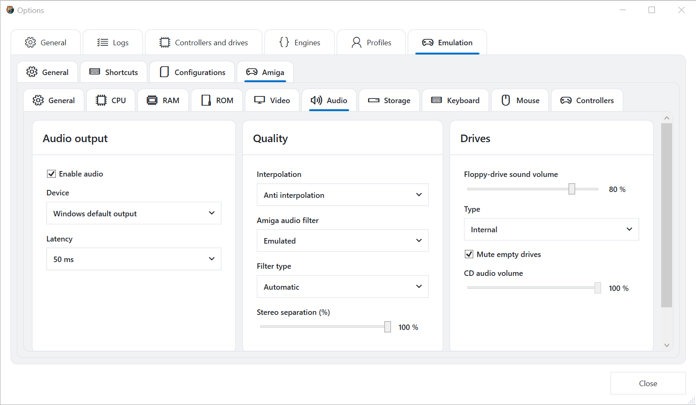

Aktivera eller inaktivera ljud, välj utgångsenheten och latensen, konfigurera sedan interpolering, Amiga filtrering, filter typ, stereo separation, floppy-drive ljud och CD-audio volym.

Lägre latens minskar fördröjningen men kan orsaka drop-outs på en upptagen dator. Öka det om ljud sprickor. Interpolering och Amiga ljudfilter ändra ljudreproduktion snarare än emulerad programlogik. Drive-sound volymen styr det simulerade mekaniska ljudet separat från normal Amiga ljud.

### Lagring

Lagringssidan listar enhetsidentifierare, typer, modeller, tillhörande media och tillgängliga åtgärder. Lägg till, konfigurera eller ta bort enheter här. Floppy diskar och CD-skivor kan infogas eller ersättas direkt från en körmaskin.

och **Enhetsidentifierare ** är hur det emulerade systemet adresserar enheten. ** Typ ** skiljer floppy, hard-disk, optisk och andra stödda enheter. ** Modellmodell ** beskriver den emulerade hårdvaran, medan ** Associerade medier** identifierar den för närvarande tilldelade bilden. Konfigurera enheten innan du associerar värdefulla skrivbara medier och hålla säkerhetskopior av hårddiskarbilder.

### Keyboard

Sök efter Sök Amiga nycklar och värduppdrag, tilldela nya nycklar, ta bort kartläggningar, återställa standarder eller tydliga konflikter. Statuskolumnen rapporterar om varje uppdrag är giltigt.

Den vänstra kolumnen heter den emulerade Amiga nyckel; **Förening** visar värdnyckelkombinationen. En giltig kartläggning kan fortfarande vara obekväm om Windows eller programmet förbehåller sig samma genväg, så testa kritiska kombinationer inuti körmaskinen. Undvik att tilldela musfrisättning eller fullskärmsgenväg till en nyckel som den emulerade programvaran behöver ofta.

### Musen

Ställ in fysisk mushastighet, välj vilken analog pinne styr musen, justera den analoga döda zonen och hastigheten och konfigurera mus-action kartläggningar. Återställ standarder eller tydliga kartläggningskonflikter vid behov.

Öka den döda zonen om en styrenhet orsakar pekare drift. Justera vänster och höger-stick hastighet oberoende när båda pinnarna är aktiverade. Den nedre kartläggningstabellen associerar värdingångar med musknappar eller åtgärder; inspektera dess konfliktstatus efter att ha ändrat kontrollerkartläggningar någon annanstans.

### Controllers

Detektera anslutna styrenheter, tilldela enheter och styrenhetstyper till Amiga portar och konfigurera kontroller kartläggningar och turbo-eld inställningar. Tillgängliga val beror på upptäckt hårdvara och den valda maskinen.

Port 1 och Port 2 är konfigurerade oberoende. **Automatisk** controller typ är en vettig utgångspunkt, men programvara som förväntar sig en viss joystick eller mus kan kräva en explicit typ. Kör detektering innan du tilldelar en ny ansluten kontroller. Turbo brand aktiverar upprepade gånger en mappad ingång och bör förbli inaktiverad om inte spelet eller programmet drar nytta av det.

## Hårdvara diagnostik och underhåll

Dessa dialoger öppnas från **Verktyg ** Tab. Varje dialog förhandsgranskar den genererade Greaseweazle kommandot. Granska det innan du klickar ** Utförlig**.

### Kontrollinformation

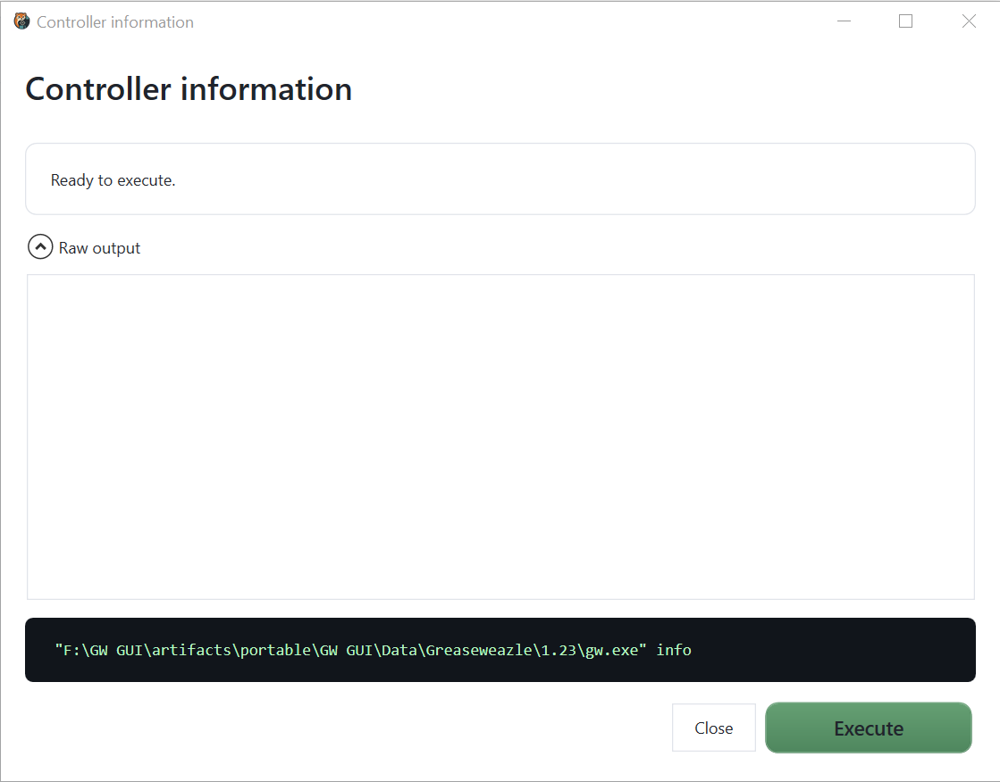

Visar information som rapporterats av den valda styrenheten. Expandera **Raw Output** När du behöver hela kommandot svar.

Använd detta som det första diagnostiska kommandot. Ett framgångsrikt svar bekräftar att GW GUI kan starta konfigurerade värdverktyg körbara och kommunicera med den valda enheten. Spela in firmware och hårdvaruinformation innan du utför en uppdatering.

### USB bandbredd

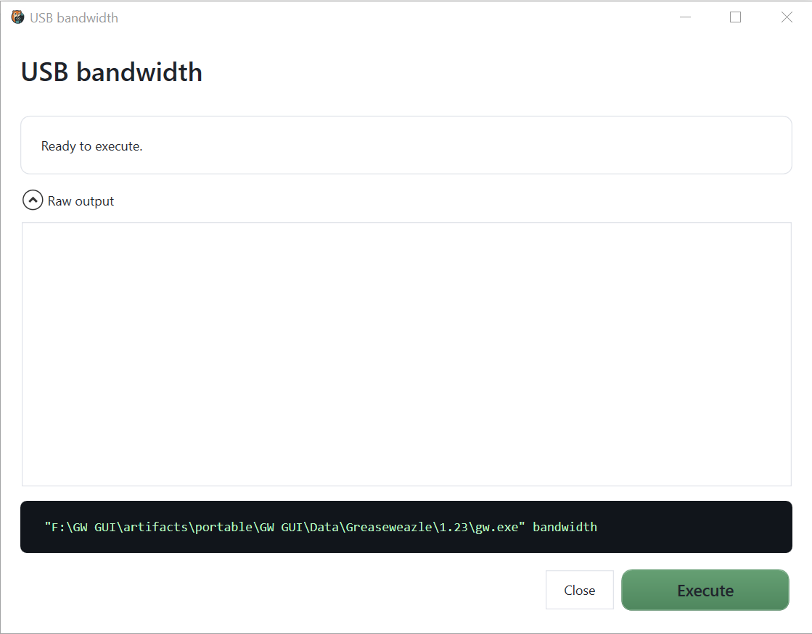

Mäter tillgängliga USB kommunikation bandbredd. Använd den för att diagnostisera instabila överföringar eller en olämplig USB anslutning.

Stäng annan programvara med hjälp av styrenheten innan du testar. Upprepa mätningen efter att ha ändrat USB Port, kabel eller hub. Jämför resultaten under liknande förhållanden snarare än att behandla en enda mätning som en absolut garanti.

### Drive speed

Mäter drivrotationshastigheten. Öka antalet mätningar när du behöver ett mer representativt resultat.

En enda mätning är en snabb kontroll; flera mätningar avslöjar om hastigheten är stabil. Låt enheten nå normal hastighet innan du tolkar resultatet. Ett oväntat värde kan indikera en fel konfigurerad hastighet, en mekanisk fråga eller ett mätinställningsproblem.

### Sök huvudet

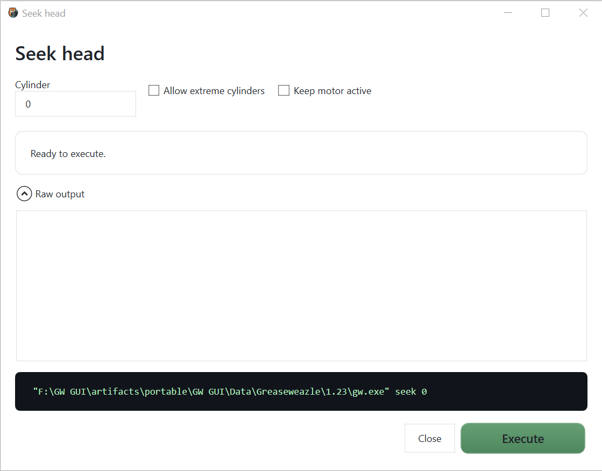

Flytta drivhuvudet till en vald cylinder. **Tillåt extrema cylindrar ** tillåter normalt begränsade positioner, och ** Håll motor aktiv** lämnar motorn som körs under driften. Använd extrema positioner endast när hårdvaruproceduren uttryckligen kräver dem.

Normalt sökande är användbart för att bekräfta huvudrörelse eller positionering före en diagnostik. Lyssna på onormala upprepade effekter och sluta om den begärda cylindern är olämplig för enheten. Detta verktyg läser eller validerar inte data på destinationscylindern.

### Drive alignment diagnostic

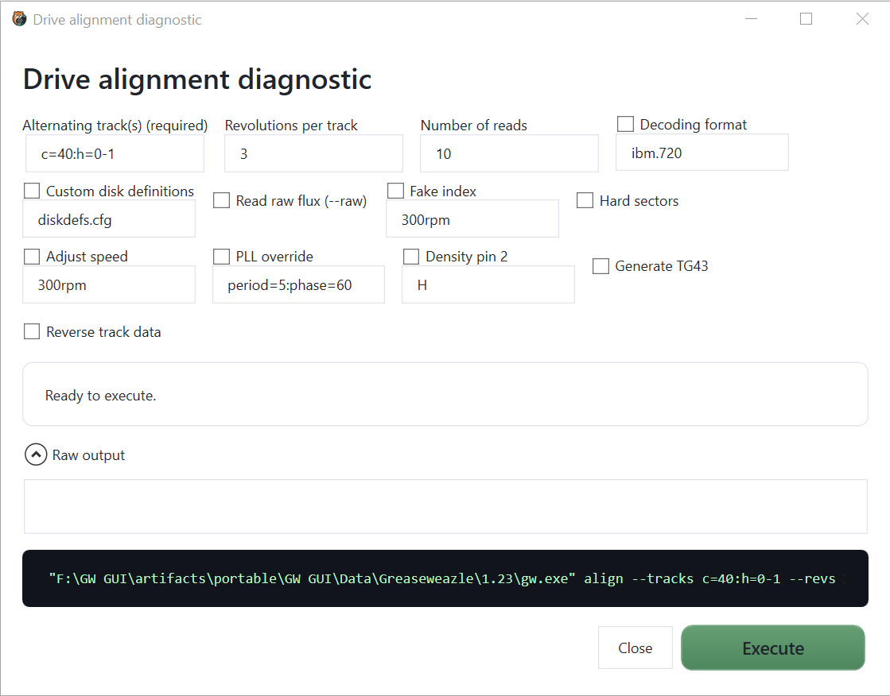

Runs upprepade läser för drive-alignment analys. Det stöder spårval, revolution och läsräkningar, avkodningsformat, råflöde, index, hastighet, PLLDensitet-pin, hård sektor, TG43och omvända dataalternativ. Anpassningsarbete kräver lämpliga referensmedier och hårdvarukunskaper.

Börja med en känd referensdisk och den minsta uppsättningen övertoner. **Alternerande spår ** definierar spår och huvuden samplade; ** Revolutioner per spår ** kontrollerar varje provperiod; ** Antal läsningar** bestämmer upprepning. Aktivera en anpassad diskdefinition eller avkodningsformat endast när det matchar referensmedierna. Alternativ som falskt index, hårda sektorer, PLL åsidosätter, densitet pins, och TG43 är hård- eller formatspecifika och kan ogiltigförklara en jämförelse när den används felaktigt.

### Hårdvara pins

Läser eller ändrar en stödd controller pin. Välj pin, aktivera **Ändra pinne ** endast när du skriver ett värde och välj ** Hög nivå** vid behov av den avsedda hårdvaruoperationen.

Med **Ändra pinne** funktionshindrade, kommandot frågar stiftet. Detta är den säkrare standarden. Ändra en nivå direkt påverkar styrenheten I/O och bör endast göras med rätt Greaseweazle hårdvarudokumentation och bifogad körning.

### Återställ styrenhet

Återställer Greaseweazle controller. Använd detta när styrenheten upptäcks men inte längre svarar normalt.

Vänta på någon aktiv diskoperation för att avsluta innan du återställer. Därefter skannar kontrollen igen om dess anslutningsstatus inte återhämtar sig automatiskt. En återställning reparerar inte ett fel `gw.exe` Vägen eller en bortkopplad USB Enhet.

### Förseningar

Läser eller ändrar controller timing värden, inklusive urval, huvudsteg, bosättning, motor, automatisk deselection, skriva timing och index mask förseningar. Aktivera endast de värden du tänker ändra.

Okontrollerade fält lämnar motsvarande kontrollervärde oförändrat. Innan du redigerar registrerar du befintliga värden. Tidsförändringar kan påverka varje efterföljande fysisk operation, så testa med utgiftsbara medier och återställa kända värden om beteendet blir opålitligt.

### Brandware

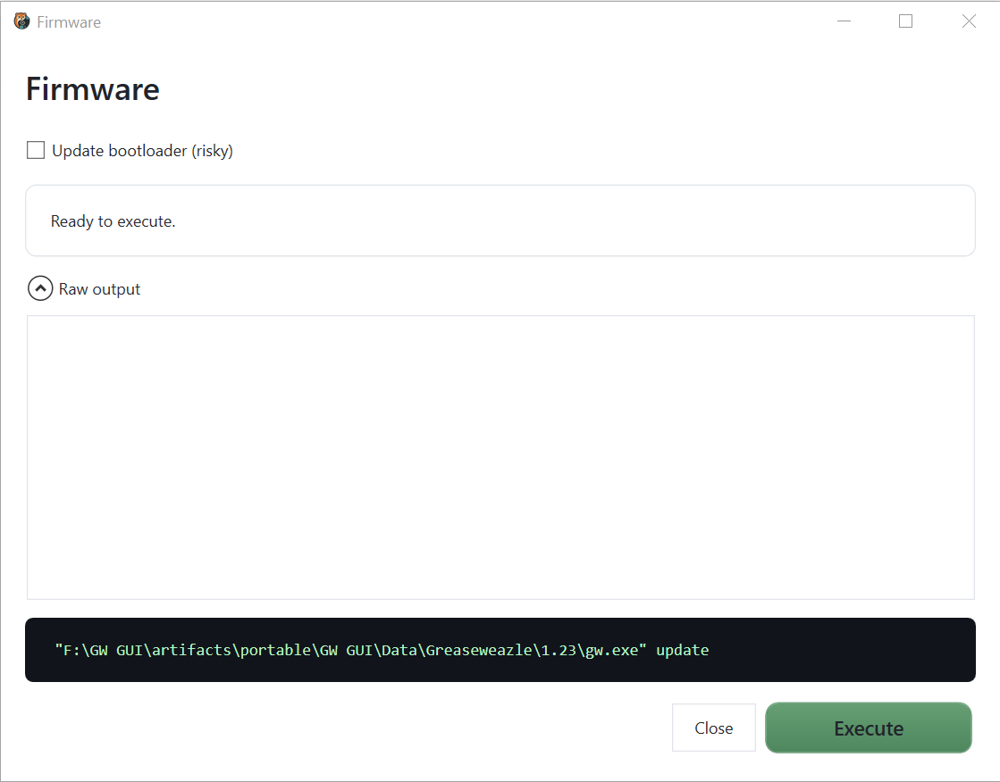

Updates controller firmware. **Uppdatera bootloader** är uttryckligen markerad som riskfylld och bör förbli funktionshindrad om inte den officiella firmware förfarande kräver det. Koppla inte bort styrenheten under en uppdatering.

Innan du uppdaterar, bekräfta den anslutna kontrollenheten med **Kontrollinformation** Använd en stabil direkt USB anslutning och stänga annan programvara som kan komma åt den. Efter avslutad, återanslut eller rescan controller och läs dess information igen för att verifiera den rapporterade firmware version.

## Loggar och operationshistoria

Öppna operationshistoriken för att inspektera sparade loggar genom drift.

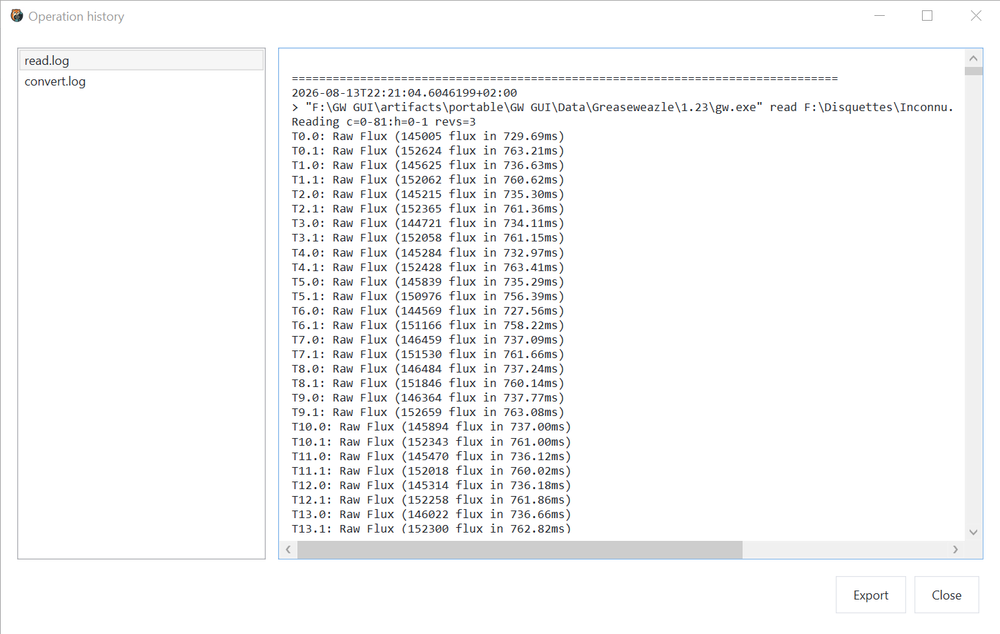

Välj en logga till vänster för att visa innehållet. **Export** sparar en kopia för diagnostik eller stöd. Vägar och kommandorader kan innehålla personliga mappnamn, så granska exporterade loggar innan du delar dem.

Den levande konsolen i huvudfönstret visar det aktuella kommandot och den senaste utgången. Dess kopieringsknapp kopierar den visade texten.

### Läsa en logg

En användbar diagnostisk logg innehåller det genererade kommandot, tidsstämplar, motorutgång och slutstatus. Arbeta från botten uppåt: identifiera det slutliga felet, sedan hitta den första varningen eller misslyckad spår som föregick det. Ett senare generiskt misslyckande är ofta bara följden av ett tidigare, mer specifikt meddelande.

När du jämför två försök, kontrollera att controller, drive, motor, profil, källväg, utgångsformat och expertargument var identiska. Annars kan ett annat resultat återspegla ändrade inställningar snarare än diskinstabilitet.

## Applikationsdata och portabel användning

GW GUI Håller användardata separat från applikationsbinärer. Beroende på det valda paketet och läget lagras inställningar, loggar, nedladdade verktyg, emulatorkomponenter, fångster, stater och maskinkonfigurationer antingen i programmet. `Data` katalog eller i de konfigurerade användardataplatserna.

Innan du byter ut eller flyttar en bärbar installation, hålla hela applikationsmappen tillsammans och säkerhetskopiera `Data` mapp. Flytta inte enskilda filer från `lib`Eftersom programmet löser sina egna och tredjepartsbibliotek från den strukturen.

### Föreslagen backup innehåll

Säkerhetskopiera följande när de är viktiga för ditt arbetsflöde:

- ansökningsinställningar och profiler;
- controller och drive definitioner;
- emuleringskonfigurationer;
- ROM Vägar och juridiskt hållna ROM backups;
- hårddiskar och flyttbara mediabilder;
- fångar och räddade stater;
- driftsloggar som används som bevarandeposter.

Diskbilder kan vara mycket större än inställningar. Store arkivmästare läser bara när det är möjligt och arbetar med kopior.

## Rekommenderade arbetsflöden

### Arkivera en okänd disk

1. Inspektera och rengöra enheten med hjälp av ett lämpligt underhållsförfarande.
2. Skrivskydda disken om möjligt.
3. Välj Välj **Läs > Rå bild (SCP)**.
4. Använd ett beskrivande filnamn och läs det normala spårintervallet med flera revolutioner.
5. Granska konsolen och sparad logg.
6. Inspektera båda sidor i **Visualisering**.
7. Konvertera en kopia till troliga sektorformat.
8. Testa de konverterade kopiorna i **Disk Explorer** eller lämplig programvara.
9. Bevara den råa mästaren, loggen och anteckningarna tillsammans.

### Återskapa en disk från en bild

1. Inspektera bilden och bekräfta dess förväntade familj och format.
2. Sätt in en expendable eller avsiktligt skrivbar disk av rätt storlek och densitet.
3. Öppet Öppet Öppet **Skriv** och välj bilden.
4. Bekräfta den konfigurerade enheten och detekterat format.
5. Skriv disken.
6. Läs den tillbaka till en separat verifieringsbild.
7. Jämför avkodade innehåll och granska misstänkta spår visuellt.

### Skapa en emulerad Amiga

1. Öppet Öppet Öppet **Alternativ > Emulering > Konfigurationer** skapa eller välja en maskin.
2. Inom **Amiga > Allmänt** Välj modell och emulator version.
3. Tilldela en kompatibel, juridiskt erhållen ROM.
4. Håll modellen standarder för CPU och RAM på den första boot.
5. Konfigurera video och ljud med konservativa automatiska inställningar.
6. Lägg till lagringsenheter och associera kopierade mediebilder.
7. Granska tangentbord, mus och controller uppdrag.
8. Spara konfigurationen.
9. Återvänd till **Emulering ** Välj det och klicka **Öppet Öppet Öppet**.
10. Först efter en framgångsrik baslinjestart, ändra acceleration eller avancerade inställningar en i taget.

## Säkerhet checklista

Före **Läs mer**:

- källdisken är i rätt enhet;
- källan är skrivskyddad om möjligt;
- utgångsvägen kommer inte att skriva över en befintlig mästare;
- profilen och spårområdet matchar disken.

Före **Skriv ** eller ** Radera**:

- destinationsdisken kan förstöras;
- Bilden och körningen är korrekt;
- diskstorlek och densitet är kompatibel;
- Ingen arkivmästare används som destination.

Innan ett maskinvaruförändrande verktyg:

- Ingen annan operation är igång;
- rätt styrenhet väljs;
- nuvarande värden har registrerats;
- styrenheten har stabil kraft och USB Anslutning;
- åtgärden stöds av hårdvarudokumentationen.

## Felsökning

### Kontrollen är inte listad

1. Återanslut styrenheten direkt till datorn.
2. Öppet Öppet Öppet **Alternativ > Controllers och drives**.
3. Klicka **Scan**.
4. Kontrollera status och enhet konfiguration.
5. Kör **Kontrollinformation** Om detektering lyckas men kommandon misslyckas.

Om det fortfarande inte visas, prova en annan direkt USB port och kabel, sedan rescan. Kontrollera Windows Device Manager för en nyligen upptäckt seriell enhet. En kontroller synlig för Windows men frånvarande från GW GUI vanligtvis pekar på en upptagen port, stal konfiguration eller Host Tools problem; en controller frånvarande från Windows-poäng till USB, kraft, förare eller hårdvara.

### `gw.exe` kan inte hittas

Öppet Öppet Öppet **Alternativ > Controllers och drives ** Använd sedan **Hitta gw.exe **, ** Välj Välj Välj Välj **eller ** Ladda ner senaste versionen**Bekräfta att den upptäckta vägen pekar på den avsedda Greaseweazle installation.

Efter att ha valt det, kör **Kontrollinformation** Om det misslyckas innan du kontaktar hårdvara, inspektera loggen för en ogiltig körbar väg, saknade filer eller en version som inte kan starta.

### En operation använder fel motor

Öppet Öppet Öppet **Alternativ > Motorer** och kontrollera motorn som tilldelats den exakta driften. GW GUI faller inte tyst tillbaka till den andra motorn.

Motorinställningar är separata: ändra konverteringsmotorn ändrar inte läsning, skrivning eller Disk ExplorerÖppna den misslyckande operationen efter att ha sparat alternativet och bekräfta det genererade kommandot i konsolen.

### En bild är inte erkänd

Inaktivera automatisk detektion endast om du vet rätt maskin och format. Annars, prova på **Visualisering** flik för att inspektera bilden på en lägre nivå.

Kontrollera om källan är en raw flux capture, en sektorsbild, en komprimerad behållare eller en orelaterade fil med en vilseledande förlängning. Aldrig byta namn på en förlängning bara för att tvinga upptäckt; omvandling måste tolka källstrukturen korrekt.

### Emulering startar inte

Kontrollera den sparade konfigurationen, installerad emulatorversion, vald ROMLagringsvägar och modellkompatibilitet. Granska ansökningsloggen för fullständiga feldetaljer.

Tillfälligt återvända CPU, RAM, video och lagring till en enkel modellkompatibel baslinje. Om baslinjen börjar, återställa en anpassad inställning i taget. Ett sparat tillstånd skapat med en annan emulatorversion eller maskindefinition kan också misslyckas även när en ren start fungerar.

### En genväg eller ingång fungerar inte

Kontrollera både globalt **Emulering > genvägar** sida och det maskinspecifika tangentbordet, musen eller kontrollsidan. Lös alla uppdrag markerade som motstridiga.

Om musen fångas, använd släppgenvägen som visas i rinnande maskinverktygsfältet. Om en styrenhet var ansluten efter Optioner öppnades, kör styrenhet upptäckt igen innan tilldela den.

### Ett kommando misslyckas oväntat

1. Läs live konsolutgången.
2. Öppet Öppet Öppet **Operationshistoria** för den fullständiga sparade loggen.
3. Bekräfta den valda styrenheten, driv, profil, motor och filvägar.
4. Exportera relevant logg om den måste delas för diagnos.

### Audio sprickor eller pauser

Öka emulering ljud latens, nära CPU-intensiva applikationer och returnera videoramskippning och acceleration till sina tidigare värden. Kontrollera att den avsedda Windows-ljudenheten väljs. Ändra en inställning i taget så att den effektiva korrigeringen är identifierbar.

### Emuleringsdisplayen är tom eller långsam

Return resolution och linjeläge till **Automatisk**, inaktivera ram hoppa och flimrare fixering tillfälligt, och prova den tidigare arbetsgivaren. Bekräfta att den konfigurerade ROM och infogade boot media är giltiga. och FPS Indikatorn hjälper till att skilja ett rendering-prestandaproblem från en maskin som helt enkelt inte har startat.

### En läsning innehåller instabila spår

Upprepa läsningen till ett nytt filnamn, öka revolutionerna i förekommande fall och jämföra de drabbade spåren. Rengör drivhuvudena med ett korrekt förfarande och inspektera disken för fysisk skada. Läs inte upprepade gånger visibly shedding eller skadade medier, eftersom ytterligare pass kan förvärra det.

## Glossary

| Termen | Betydelse i GW GUI |
|---|---|
| Controller | och Greaseweazle hårdvarugränssnitt kopplat över USB |
| Drive | Den fysiska diskettenheten fäst vid kontrollern |
| Motorer | Det valda genomförandet för att utföra en operation |
| Flux | Tidsinformation som representerar magnetiska övergångar läs från en disk |
| Raw bild | En fångst som behåller diskinformation på låg nivå, till exempel SCP |
| Sektorbild | En avkodad representation organiserad i logiska sektorer |
| Revolutionär revolution | En komplett rotation samplad medan du läser ett spår |
| Cylinder | En radiell huvudposition; en cylinder kan innehålla ett spår på varje sida |
| Head | Skivsidan vald av den fysiska enheten |
| Profil | En återanvändbar uppsättning inställningar för en operation |
| ROM | Firmware bild krävs av en emulerad maskin |
| Sparad stat | En ögonblicksbild av en löpande emulatorns maskintillstånd |
| Renderer | Grafiken backend används för att visa emuleringsutgång |

## Snabb referens

| Om du vill... | Gå till... |
|---|---|
| Bevara en fysisk disk | **Läs mer** |
| Lägg en bild tillbaka på en disk | **Skriv** |
| Producera ett annat bildformat | **Konvertering** |
| Inspektera spår eller flux anomalier | **Visualisering** |
| Bläddra filer inuti en bild | **Disk Explorer** |
| Kontrollkontroll kommunikation | **Verktyg > Kontrollinformation** |
| Measure drive rotation | **Verktyg > Drive speed** |
| Granska ett tidigare kommando | **Operationshistoria** |
| Konfigurera hårdvara | **Alternativ > Controllers och drives** |
| Välj implementeringar | **Alternativ > Motorer** |
| Skapa eller redigera en emulerad maskin | **Alternativ > Emulering** |
| Starta en sparad maskin | **Emulering** |
